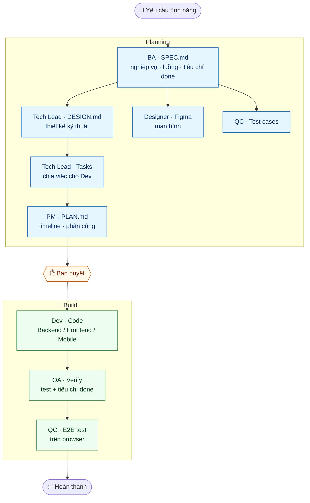

# Sitter Navi — AI Agent Workspace

Thư mục làm việc chung dùng **AI agent** để làm tài liệu & code cho dự án **Sitter Navi** (nền tảng kết nối phụ huynh ↔ babysitter cho thị trường Nhật).

Bạn ra lệnh bằng tiếng Việt tự nhiên, hệ thống có sẵn các "nhân viên ảo" (BA, Tech Lead, PM, Dev, QC, QA, Designer) làm việc theo quy trình chuẩn. Không cần nhớ lệnh — mỗi bước xong sẽ gợi ý bước kế tiếp.

---

## 1. Có gì trong thư mục này

| Thư mục | Nội dung |
|---|---|
| `repositories/` | Source code 4 repo Sitter Navi (backend, web admin, 2 app mobile) |
| `sitter-navi-docs/` | Toàn bộ tài liệu: nghiệp vụ, overview repo, SPEC/DESIGN/PLAN từng feature |
| `.claude/` | Bộ AI agent + quy tắc dự án (không cần đụng tới) |
| `AGENTS.md` · `POLICIES.md` | Quy tắc AI phải tuân theo (đọc để hiểu giới hạn) |

**4 repo:** `sitternavi-web-BE` (backend) · `sitternavi-web` (web admin) · `sitternavi-app-parents` (app phụ huynh) · `sitternavi-app-babysitter` (app sitter).

---

## 2. Cài đặt (1 lần)

**Bắt buộc — Claude Code:**
```bash
npm install -g @anthropic-ai/claude-code
cd /đường-dẫn/tới/AI_AGENT_SITTER_NAVI
claude          # mở AI ngay tại thư mục này
```

**Khuyến nghị — MCP để agent làm việc tốt hơn** (khai trong `.claude/settings.json`):
- **tilth** — đọc/tìm code thông minh (thay grep/find). Không có cũng chạy được, agent tự chuyển sang tìm thường.
- **Figma** — cần cho Designer & QC Automation.
- **Backlog** — cần cho PM nếu quản lý issue trên Backlog.

**Xem tài liệu (MkDocs) — nếu muốn đọc doc bằng browser:**
```bash
cd sitter-navi-docs
./.venv/bin/mkdocs serve      # mở http://127.0.0.1:8000
```
> Đã có sẵn môi trường `.venv` — không cần cài lại. Trang chủ có sơ đồ hành trình tổng quan + menu tính năng.

---

## 3. Cách dùng

Gõ lệnh (`/tên-lệnh`) **hoặc** nói tự nhiên ("hãy là BA, làm SPEC cho tính năng đặt lịch"). Cả hai như nhau.

### Làm một tính năng mới — quy trình BMAD

Chạy lần lượt (mỗi bước xong sẽ gợi ý lệnh kế tiếp ở cuối output):

```
/create-spec  <tên feature>     → BA viết SPEC.md (nghiệp vụ, luồng, tiêu chí done)
/create-design <SPEC.md>        → Tech Lead thiết kế kỹ thuật DESIGN.md   ┐ chạy
/create-ui-design <SPEC.md>     → Designer dựng màn hình Figma            ┤ song
/test/generate_manual_testcases_rbt → QC sinh test case                  ┘ song
/create-tasks <feature/>        → Tech Lead chia task cho Dev
/create-plan  <feature/>        → PM lập kế hoạch, timeline
"Hãy là Backend/Frontend/Mobile Developer, implement task: <task-x-y.md>"
"Hãy là QA, verify task: <task-x-y.md>"
```

**Chạy nhanh cả pipeline (không cần gõ từng lệnh):**
```
/create-feature <feature> [mô tả]   → BA → Design → Tasks (dừng lại để bạn duyệt)
/create-feature <feature> build     → Dev → QA → QC (sau khi đã duyệt)
```

### Việc lẻ khác
```
/review-code <file>          → review code theo chuẩn dự án
/init-kit                    → thêm repo mới vào dự án (chạy lại khi cần)
```

---

## 4. Lưu ý quan trọng

- **AI không tự commit / push** — chỉ khi bạn yêu cầu rõ.
- **Chỉ Dev agent được sửa source code** — BA/PM/Tech Lead/QC/QA chỉ tạo file `.md`.
- **Không đưa code ra ngoài** — không paste lên tool public, không hardcode secret.
- **Không đoán mò** — thiếu thông tin agent sẽ hỏi lại bạn, đừng bỏ qua câu hỏi đó.
- Hai app mobile tên gần giống → luôn xác nhận đúng repo bằng **đường dẫn**, không dựa tên package.

Chi tiết quy trình & giới hạn → đọc `AGENTS.md` và `POLICIES.md`.

---

## 5. Toàn cảnh quy trình

Một yêu cầu tính năng đi qua các "nhân viên ảo" như sau — mỗi ô là một agent, mỗi bước xong tự gợi ý bước kế tiếp:



> **Bạn chỉ cần**: nêu yêu cầu → duyệt ở cửa ải giữa (✋) → nghiệm thu cuối. Phần còn lại các agent tự dẫn dắt.

