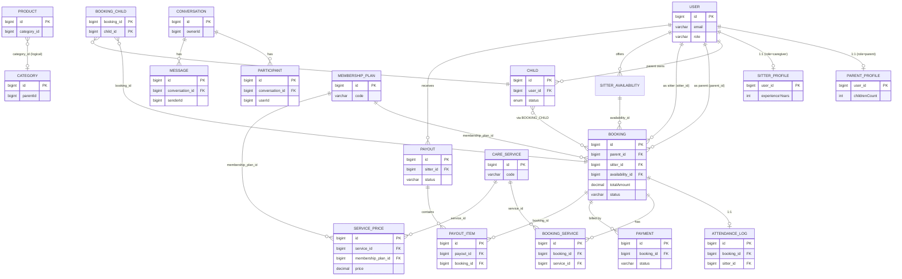

# sitternavi-web-BE — ERD

> Nguồn: scan repo 2026-07-02. Cập nhật khi code đổi (xem Memory Update Gate).

TypeORM 0.3.26 · PostgreSQL. 55 entity (4 base/shared + 51 module).

## Conventions chung

- **PK:** hầu hết dùng Snowflake `id bigint` (qua `WithIdAndTimestamp`, gán ở `@BeforeInsert`). Ngoại lệ: `SitterProfile`/`ParentProfile` PK = `user_id` (qua `WithTimestamp`, 1:1 với user); `BookingChild` composite PK (`booking_id`,`child_id`), không base; `SnowflakeInstanceEntity` PK `smallint`.
- **Timestamps + soft-delete:** `created_at` / `updated_at` / `deleted_at` (timestamptz) cho mọi entity dùng base class. KHÔNG có ở `BookingChild`, `SnowflakeInstanceEntity`.
- **Column naming:** code camelCase → DB snake_case (SnakeNamingStrategy). Money = `decimal(15,2)` (trừ `Product.price` = decimal(10,2), `Child.normalBodyTemperature` = decimal(3,1)).
- **Enum storage:** đa số status lưu `varchar` + default. Chỉ `Child.status`, `Child.gender` dùng native pg enum.
- **`User` là hub:** parent & sitter là cùng bảng `user`, phân biệt bằng cột `role` (RoleType admin/parent/caregiver).
- **Decoupled logical FK** (cột ID, KHÔNG có `@ManyToOne`): `otp.user_id`, `refresh_token.user_id`, `product.category_id`, `faq_sub_category.faq_category_id`, `faq_item.faq_sub_category_id`. Là quan hệ thật về mặt nghiệp vụ.
- **Conversation module** nằm ở schema Postgres riêng `conversation`.

Base: `WithIdAndTimestamp` = `id bigint` PK + timestamps + soft-delete. `WithTimestamp` = chỉ timestamps + soft-delete (no id).

---

## 1. User / Auth

### `user` — UserEntity (WithIdAndTimestamp)
| Column | Type | Note |
|---|---|---|
| id | bigint | PK |
| email | varchar | not null, lowercased |
| password | varchar | nullable, `@Exclude` |
| fullNameKanji / fullNameKana | varchar | nullable |
| position / phoneNumber / address | varchar | nullable |
| role | varchar | default `parent` (RoleType) |
| isActive | boolean | default true |
| isLocked | boolean | default false |
| childrenCount | (VirtualColumn) | subquery COUNT children, không stored |

Relations: `@OneToMany` → SocialAccount (`socialAccounts`).

### `social_account` — SocialAccountEntity (WithIdAndTimestamp)
Cols: `userId` bigint, `provider` varchar(50) (enum `SocialProvider` = line/apple), `providerUserId` varchar(255), `providerEmail` varchar(255) nullable. Unique(`provider`,`providerUserId`). Relations: `@ManyToOne` → User (FK `user_id`, CASCADE).

### `otp` — OTPEntity (WithIdAndTimestamp)
Cols: `userId` bigint nullable+unique (decoupled), `otp` text, `expiredAt` timestamptz, `identifier` varchar unique, `purpose` varchar (enum `OtpPurpose` = password_reset/login_verify/email_verify), `retry` int, `isUsed` boolean, `meta` jsonb. No relations.

### `refresh_token` — RefreshTokenEntity (WithIdAndTimestamp)
Cols: `userId` bigint (indexed, decoupled), `tokenHash` varchar(64) unique `@Exclude`, `expiresAt` timestamptz, `revokedAt` timestamptz nullable, `meta` jsonb. No relations.

### `api_keys` — ApiKey (WithIdAndTimestamp)
Cols: `name` varchar(200), `description` varchar(500) nullable, `keyHash` varchar(64) indexed `@Exclude`, `keyPrefix` varchar(20), `scopes` jsonb (string[]) nullable, `isActive` boolean, `expiresAt`/`lastUsedAt` timestamptz nullable. No relations.

## 2. Permission

| Table / Entity | Key columns | Relations |
|---|---|---|
| `permissions` / Permission | `resource` v(100), `action` v(100), `key` v(200) unique, `description`/`source`/`httpMethod` nullable | — |
| `permission_groups` / PermissionGroup | `name` v(200), `slug` v(200) unique, `description` nullable | `@OneToMany` → PermissionGroupItem (`items`, eager) |
| `permission_group_items` / PermissionGroupItem | `groupId`, `permissionId` — Unique(group,permission) | `@ManyToOne` → PermissionGroup (`group_id`); → Permission (`permission_id`, eager) |
| `role_permissions` / RolePermission | `role` v(50), `permissionId` — Unique(role,permission) | `@ManyToOne` → Permission (`permission_id`, eager) |
| `user_permissions` / UserPermission | `userId`, `permissionId`, `type` (enum granted/revoked) — Unique(user,permission) | `@ManyToOne` → Permission (`permission_id`, eager) |
| `user_permission_groups` / UserPermissionGroup | `userId`, `groupId` — Unique(user,group) | `@ManyToOne` → PermissionGroup (`group_id`, eager) |

## 3. Sitter

| Table / Entity | Base | Key columns | Relations |
|---|---|---|---|
| `sitter_profile` / SitterProfile | WithTimestamp (PK=userId) | `introduction` text, `experienceYears` int | `@OneToOne` → User (`user_id`) |
| `sitter_availability` / SitterAvailability | WithId… | `sitterId`, `startTime`, `endTime`, `status` (enum `AvailabilityStatus` available/booked/unavailable) | `@ManyToOne` → User (`sitter_id`) |
| `sitter_certification` / SitterCertification | WithId… | `sitterId`, `courseId`, `issuedAt` | `@ManyToOne` → User (`sitter_id`); → TrainingCourse (`course_id`, RESTRICT) |
| `sitter_service` / SitterService | WithId… | `sitterId`, `serviceId`, `customPrice` decimal nullable | `@ManyToOne` → User (`sitter_id`); → CareService (`service_id`) |

## 4. Parent / Children

| Table / Entity | Base | Key columns | Relations |
|---|---|---|---|
| `parent_profile` / ParentProfile | WithTimestamp (PK=userId) | `childrenCount` int, `childrenAges` int[] nullable | `@OneToOne` → User (`user_id`) |
| `children` / Child | WithId… | `userId` (parent), `status` (pg enum ChildStatus draft/complete), `firstName`/`lastName`(+furigana), `dateOfBirth`, `gender` (pg enum male/female), medical & personal fields (nhiều text/boolean nullable), `normalBodyTemperature` decimal(3,1) | `@ManyToOne` → User (`user_id`) |
| `emergency_contact` / EmergencyContact | WithId… | `name`, `departmentRole`, `phoneNumber` | — |

## 5. Booking / Attendance

| Table / Entity | Key columns | Relations |
|---|---|---|
| `booking` / Booking | `parentId`, `sitterId`, `availabilityId`, `membershipPlanId` nullable, `baseAmount`/`serviceAmount`/`discountAmount`/`totalAmount` decimal, `status` (enum `BookingStatus` pending/confirmed/in_progress/completed/cancelled) | `@ManyToOne` → User×2 (`parent_id`,`sitter_id`, RESTRICT); → SitterAvailability (`availability_id`); → MembershipPlan (`membership_plan_id`, SET NULL) |
| `booking_child` / BookingChild (no base, composite PK) | `bookingId`+`childId` PK | `@ManyToOne` → Booking (`booking_id`, CASCADE); → Child (`child_id`, CASCADE) |
| `booking_service` / BookingService | `bookingId`, `serviceId`, `unitPrice`, `subtotal` decimal | `@ManyToOne` → Booking (`booking_id`); → CareService (`service_id`, RESTRICT) |
| `attendance_log` / AttendanceLog | `bookingId`, `sitterId`, `checkInAt`, `checkOutAt` nullable | `@OneToOne` → Booking (`booking_id`); `@ManyToOne` → User (`sitter_id`) |
| `review` / Review | `bookingId`, `parentId`, `sitterId`, `rating` int (1–5) | `@OneToOne` → Booking (`booking_id`); `@ManyToOne` → User×2 (`parent_id`,`sitter_id`) |

## 6. Care / Training

| Table / Entity | Key columns | Relations |
|---|---|---|
| `care_service` / CareService | `code` v(50) unique, `name` | — |
| `training_course` / TrainingCourse | `code` v(50) unique, `title`, `isRequired` boolean | — |
| `training_session` / TrainingSession | `courseId`, `startTime`, `endTime` | `@ManyToOne` → TrainingCourse (`course_id`) |
| `sitter_training_session` / SitterTrainingSession | `sitterId`, `trainingSessionId`, `status` (enum registered/attended/absent/cancelled) | `@ManyToOne` → User (`sitter_id`); → TrainingSession (`training_session_id`) |

## 7. Catalog / Product / Membership

| Table / Entity | Key columns | Relations |
|---|---|---|
| `category` / Category | `code`, `name`, `sortOrder`, `isActive`, `parentId` nullable | self `@ManyToOne` (`parent`) + `@OneToMany` (`children`) |
| `product` / Product | `name` v(255), `description` text, `price` decimal(10,2), `sku` v(100) unique, `isActive`, `sortOrder`, `categoryId` (decoupled) | — |
| `service_price` / ServicePrice | `serviceId`, `membershipPlanId`, `price` decimal | `@ManyToOne` → CareService (`service_id`); → MembershipPlan (`membership_plan_id`) |
| `membership_plan` / MembershipPlan | `code` v(50) unique, `name` | — |
| `parent_membership` / ParentMembership | `parentId`, `membershipPlanId`, `startedAt`, `expiredAt` | `@ManyToOne` → User (`parent_id`); → MembershipPlan (`membership_plan_id`, RESTRICT) |

## 8. Payment / Payout (internal ledger, no external gateway)

| Table / Entity | Key columns | Relations |
|---|---|---|
| `payment` / Payment | `bookingId`, `amount` decimal, `status` (enum `PaymentStatus` pending/paid/failed/refunded) | `@ManyToOne` → Booking (`booking_id`, RESTRICT) |
| `payout` / Payout | `sitterId`, `amount` decimal, `status` (enum `PayoutStatus` pending/processing/completed/failed) | `@ManyToOne` → User (`sitter_id`, RESTRICT) |
| `payout_item` / PayoutItem | `payoutId`, `bookingId`, `amount` decimal | `@ManyToOne` → Payout (`payout_id`, CASCADE); → Booking (`booking_id`, RESTRICT) |

## 9. Messaging — Conversation (schema `conversation`)

| Table / Entity | Key columns | Relations |
|---|---|---|
| `conversation.conversation` / Conversation | `name` v(100), `type` (enum direct/group), `kind` (enum internal/parent_room) nullable, `avatarFileKey` nullable, `ownerId`, `lastMessageId`/`lastMessageAt` nullable | `@OneToMany` → Participant, Message |
| `conversation.participant` / Participant | `conversationId`, `userId`, `role` (enum owner/admin/member), `unreadCount`, `joinedAt` — Unique(conv,user) | `@ManyToOne` → Conversation (`conversation_id`) |
| `conversation.message` / Message | `conversationId`, `senderId`, `clientMessageId` uuid, `content` text nullable, `messageType` (enum text/image/file/system) — Unique(conv,sender,clientMsg) | `@ManyToOne` → Conversation; `@OneToMany` → MessageAttachment |
| `conversation.message_attachment` / MessageAttachment | `messageId`, `fileKey`, `fileName`, `fileSize` bigint, `contentType` | `@ManyToOne` → Message (`message_id`) |
| `conversation.message_status` / MessageStatus | `messageId`, `userId`, `conversationId`, `status` (enum sent/delivered/read), `deliveredAt`/`readAt` nullable — Unique(msg,user) | `@ManyToOne` → Message (`message_id`) |

## 10. Messaging — Email / Push

| Table / Entity | Key columns | Note |
|---|---|---|
| `email_template` / EmailTemplate | `name` unique, `subject`, `body` text (EJS), `type` (enum system/marketing/notification), `isActive` | — |
| `outbox_email` / OutboxEmail | outbox: `status`(OutboxStatus)/`tryCount`/`maxRetries`(3)/`lastError`/`lastAttemptAt`/`nextRetryAt` + `toAddress`,`subject`,`body`,`templateName`,`eventName` | implements `IOutboxRecord` |
| `push_template` / PushTemplate | `name` unique, `title`, `body` text (EJS), `imageUrl` nullable, `dataPayload` jsonb, `type` (enum), `isActive` | — |
| `outbox_push` / OutboxPush | outbox 6 fields + `userId`,`deviceTokens` jsonb(string[]),`title`,`body`,`imageUrl`,`dataPayload` jsonb,`templateName`,`eventName` | implements `IOutboxRecord` |
| `user_device` / UserDevice | `userId`, `deviceToken` unique, `platform` (enum ios/android/web), `deviceName` nullable, `isActive`, `lastUsedAt` | — |

## 11. Japan Address (master data)

| Table / Entity | Key columns | Relations |
|---|---|---|
| `prefecture` / Prefecture | `nameJa`, `nameKana`, `nameEn` nullable, `priority` int | `@OneToMany` → Municipality |
| `municipality` / Municipality | `prefectureId` nullable, `code`, `nameJa`, `nameKana` | `@ManyToOne` → Prefecture (`prefecture_id`); `@OneToMany` → PostalCode |
| `postal_code` / PostalCode | `municipalityId` nullable, `postalCode`, `nameJa` text, `nameKana` text | `@ManyToOne` → Municipality (`municipality_id`) |

## 12. FAQ

| Table / Entity | Key columns | Note |
|---|---|---|
| `faq_category` / FaqCategory | `code`, `name`, `sortOrder`, `isActive` | — |
| `faq_sub_category` / FaqSubCategory | `code`, `name`, `sortOrder`, `isActive`, `faqCategoryId` | logical FK → FaqCategory (decoupled) |
| `faq_item` / FaqItem | `question`, `answer` text, `sortOrder`, `isActive`, `faqSubCategoryId` | logical FK → FaqSubCategory (decoupled) |

## 13. Misc / Infra

| Table / Entity | Key columns | Note |
|---|---|---|
| `snowflake_instance` / SnowflakeInstanceEntity | `id` smallint PK (0–4095), `holder` v(255), `acquiredAt`, `expiresAt` (indexed) | pod machine-id lease; no soft-delete |
| `uploaded_file` / UploadedFile | `fileKey` varchar, `createdById` bigint nullable, `committedAt` timestamp nullable | S3 upload tracking |

---

## Mermaid — Core entities

