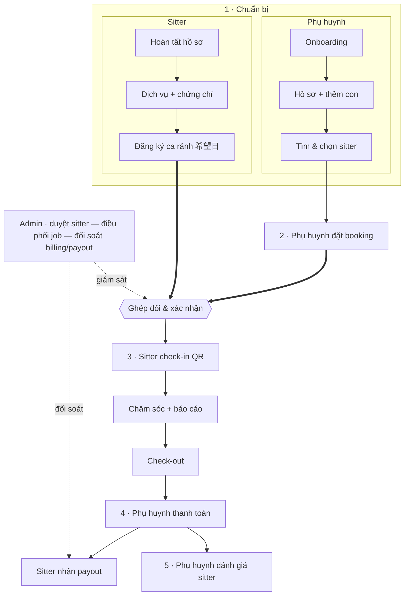

# Sitter Navi — Documentation

Long-memory của dự án Sitter Navi (dịch vụ kết nối phụ huynh ↔ babysitter cho thị trường Nhật Bản). Sinh ra bởi các AI agent (BA / Tech Lead / PM / Dev) theo pipeline BMAD trong `AGENTS.md`.

## Hành trình tổng quan (End-to-end journey)

Dòng chảy chính của sản phẩm: phụ huynh và sitter chuẩn bị độc lập → **ghép đôi** ở bước booking → chăm sóc → dòng tiền → đánh giá. Admin giám sát xuyên suốt.



## Repo Overview

Tài liệu nền cho mỗi repo — FE/BE/Mobile agent đọc trước khi code:

- **backend/** `sitternavi-web-BE` — `structure` · `patterns` · **`api-catalog`** (nguồn contract) · `erd`
- **frontend/** `sitternavi-web` (admin dashboard) — `structure` · `patterns`
- **mobile/** `sitternavi-app-parents` & `sitternavi-app-babysitter` — `structure` · `patterns`

## Feature docs (BMAD)

```
features/<feature-name>/
├── SPEC.md              ← BA — nghiệp vụ, actors, flow, AC, Screens
├── PLAN.md              ← PM — kế hoạch, timeline, dependencies
└── <repo>/
    ├── DESIGN.md        ← Tech Lead — thiết kế kỹ thuật per repo
    └── tasks/task-*.md  ← Task chi tiết cho Dev implement
```

Dùng menu bên trái (tự sinh theo thư mục qua awesome-pages — không cần sửa `mkdocs.yml` khi thêm feature) để duyệt.
