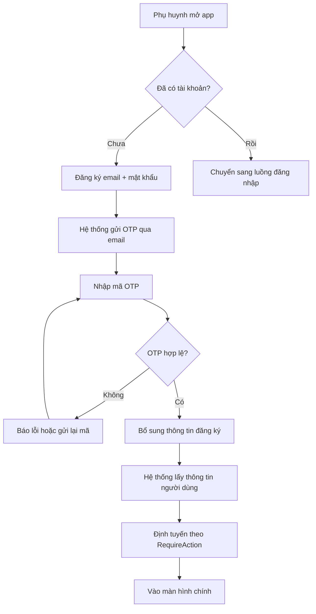
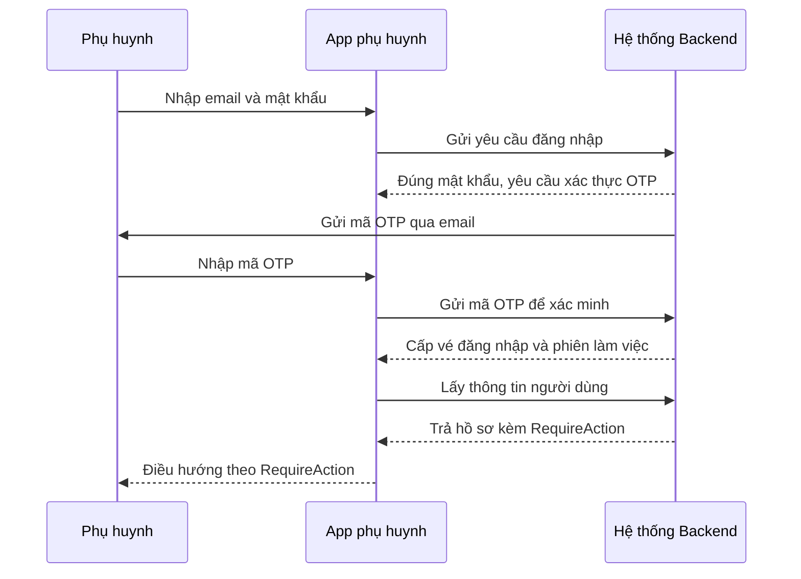
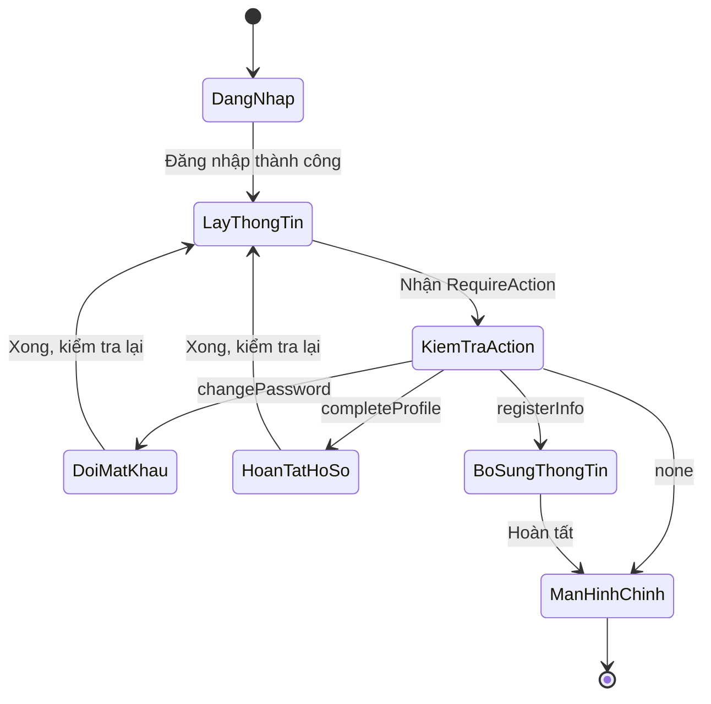
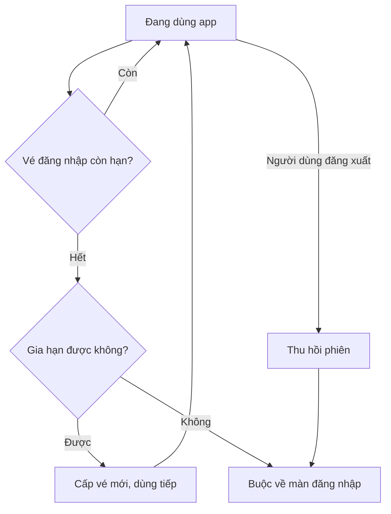

# Đăng nhập & Onboarding

> Cách người dùng Sitter Navi tạo tài khoản, đăng nhập an toàn, và được dẫn từng bước để hoàn tất hồ sơ trước khi dùng dịch vụ.

## Tổng quan

Sitter Navi là nền tảng kết nối **phụ huynh** với **người trông trẻ (babysitter/sitter)** tại Nhật. Có 3 điểm truy cập riêng biệt:

- **App phụ huynh** (Flutter) — nơi phụ huynh tìm sitter, quản lý con và đặt lịch.
- **App babysitter** (Flutter) — nơi sitter đăng ký lịch làm, nhận việc.
- **Web quản trị** (Next.js) — dành cho ADMIN/OPERATOR vận hành hệ thống, KHÔNG dành cho phụ huynh/sitter.

Tính năng "Đăng nhập & Onboarding" là **cửa vào** của cả hệ thống. Mục tiêu nghiệp vụ:

1. **Đăng ký dễ** — cho phép tạo tài khoản bằng email hoặc tài khoản mạng xã hội (LINE, Apple).
2. **Đăng nhập an toàn** — phụ huynh đăng nhập bằng email + mật khẩu phải qua thêm một lớp xác thực OTP gửi về email.
3. **Dẫn dắt onboarding** — sau khi đăng nhập, hệ thống tự quyết định người dùng cần làm gì tiếp theo (đổi mật khẩu tạm, hoàn tất hồ sơ, bổ sung thông tin…) trước khi cho vào màn hình chính. Đây là cơ chế **RequireAction**.

Vì sao quan trọng: một người dùng chưa hoàn tất hồ sơ sẽ không đặt/nhận được lịch. RequireAction đảm bảo không ai "lọt" vào app khi còn thiếu bước bắt buộc, mà không cần nhân viên nhắc thủ công.

## Actors

| Actor | Điểm truy cập | Vai trò trong luồng này |
|---|---|---|
| **Phụ huynh** | App phụ huynh | Đăng ký, đăng nhập email+mật khẩu (bắt buộc OTP), hoặc social login LINE/Apple; bổ sung thông tin onboarding |
| **Babysitter / Sitter** | App babysitter | Đăng nhập; thường bị yêu cầu đổi mật khẩu tạm và hoàn tất hồ sơ sitter khi mới được cấp tài khoản |
| **Admin / Operator** | Web quản trị | Đăng nhập qua cổng riêng; quên mật khẩu qua email; không dùng OTP như phụ huynh |
| **Hệ thống (Backend)** | — | Cấp/kiểm tra OTP, phát hành token đăng nhập, và trả về **RequireAction** để định tuyến onboarding |

## Chức năng chính

| # | Chức năng | Mô tả ngắn (ngôn ngữ nghiệp vụ) | Ai dùng |
|---|---|---|---|
| 1 | **Đăng ký tài khoản** | Tạo tài khoản mới, sau đó bổ sung thông tin cơ bản | Phụ huynh |
| 2 | **Đăng nhập email + mật khẩu** | Nhập email/mật khẩu; phụ huynh phải xác nhận thêm bằng OTP | Phụ huynh |
| 3 | **Social login (LINE / Apple)** | Đăng nhập nhanh bằng tài khoản LINE hoặc Apple, không cần nhớ mật khẩu | Phụ huynh |
| 4 | **Xác thực OTP** | Nhận mã một lần qua email để xác nhận danh tính; có thể gửi lại mã | Phụ huynh |
| 5 | **Duy trì phiên & đăng xuất** | Giữ đăng nhập lâu dài an toàn; đăng xuất thu hồi phiên | Phụ huynh, Sitter |
| 6 | **Đăng nhập quản trị** | Cổng đăng nhập riêng cho admin, kèm quên/đặt lại mật khẩu qua email | Admin |
| 7 | **Định tuyến onboarding (RequireAction)** | Sau đăng nhập, hệ thống chỉ ra bước bắt buộc kế tiếp và đưa người dùng tới đúng màn hình | Tất cả |

**Bốn trạng thái RequireAction** (do hệ thống trả về sau khi lấy thông tin người dùng):

| RequireAction | Ý nghĩa nghiệp vụ | Người dùng được đưa tới |
|---|---|---|
| `changePassword` | Đang dùng mật khẩu tạm, phải đổi trước khi tiếp tục | Màn đổi mật khẩu |
| `completeProfile` | Hồ sơ chưa đủ (điển hình với sitter mới) | Màn hoàn tất hồ sơ (chế độ onboarding) |
| `registerInfo` | Cần bổ sung thông tin đăng ký cơ bản | Màn nhập thông tin / vào app |
| `none` | Không còn bước bắt buộc | Vào thẳng màn hình chính |

> Ánh xạ RequireAction → màn hình ở **app babysitter** đã xác nhận trong mã nguồn (`startup_router.dart`). Ở **app phụ huynh**, enum `RequireAction` tồn tại và cùng cơ chế, nhưng ánh xạ chi tiết từng nhánh sang màn hình cụ thể của app phụ huynh **(cần xác nhận)**.

## Luồng nghiệp vụ

### 1. Hành trình đăng ký → OTP → vào app (phụ huynh)

Phụ huynh tạo tài khoản, xác nhận email bằng OTP, rồi bổ sung thông tin trước khi được đưa vào app.

*Sau khi xác thực OTP thành công, phụ huynh nhập thông tin cơ bản; hệ thống lấy hồ sơ và dùng RequireAction để quyết định vào thẳng app hay còn bước bắt buộc.*

### 2. Đăng nhập phụ huynh có thử thách OTP

Đăng nhập bằng email + mật khẩu không cấp quyền ngay: hệ thống phát hành một "thử thách OTP", chỉ khi nhập đúng mã mới nhận được vé vào app.

*Mật khẩu đúng chỉ mở ra bước OTP; danh tính chỉ được xác nhận sau khi nhập đúng mã, giảm rủi ro lộ mật khẩu.*

### 3. Định tuyến onboarding theo RequireAction

Ngay sau khi lấy thông tin người dùng, hệ thống trả về một RequireAction và app tự đưa người dùng tới đúng màn hình bắt buộc.

*Người dùng có thể phải qua nhiều bước bắt buộc liên tiếp; mỗi lần hoàn tất, hệ thống kiểm tra lại cho tới khi RequireAction là `none` mới cho vào màn hình chính.*

### 4. Duy trì phiên & đăng xuất

Phiên đăng nhập được gia hạn ngầm để người dùng không phải đăng nhập lại liên tục; khi hết hạn hoặc đăng xuất, người dùng quay về màn đăng nhập.

*Khi hệ thống phát hiện phiên hết hạn và không gia hạn được, người dùng bị đưa về màn đăng nhập; đăng xuất chủ động cũng thu hồi phiên ngay.*

## Màn hình & điểm chạm

**App phụ huynh** (thư mục `features/auth/` gồm `login`, `register`, `forgot_password`, `me`):

| Màn hình / điểm chạm | Vai trò |
|---|---|
| Splash | Màn khởi động, quyết định điều hướng theo trạng thái đăng nhập |
| Start | Onboarding / chọn cách đăng nhập |
| Đăng nhập | Email + mật khẩu, nút LINE, nút Apple |
| Đăng ký | Tạo tài khoản + bổ sung thông tin |
| Nhập OTP | Nhập mã, đếm giờ, gửi lại mã |
| Quên / đặt lại mật khẩu | Khôi phục qua OTP |

**App babysitter** (`features/auth/login`, `auth/change_password`, `auth/forgot_password`; `features/session` xử lý `/me` + RequireAction; `features/edit_sitter_profile` cho onboarding hồ sơ):

| Màn hình / điểm chạm | Vai trò |
|---|---|
| Splash | Cổng bootstrap, đọc RequireAction để chọn màn đích |
| Đăng nhập | Email + mật khẩu |
| Đổi mật khẩu | Nhánh `changePassword` (mật khẩu tạm) |
| Hoàn tất hồ sơ sitter | Nhánh `completeProfile` (chế độ onboarding) + màn xác nhận |
| Quên mật khẩu | Chuỗi email → OTP → đặt lại → thành công |

**Web quản trị** (route group `(auth)`):

| Màn hình | Vai trò |
|---|---|
| Đăng nhập admin (`/sign-in`) | Cổng đăng nhập riêng cho admin |
| Quên mật khẩu | Modal gửi email khôi phục |
| Đặt lại mật khẩu (`/reset-password`) + trang thành công | Đặt lại qua link email |

> Điểm chạm ngoài màn hình: **email** (nhận OTP, link khôi phục admin) và **tài khoản LINE/Apple** (social login).

## Trạng thái hiện tại & Gaps

- **Đã có & hoạt động:** đăng ký, đăng nhập email+mật khẩu có OTP cho phụ huynh, social login LINE/Apple, OTP (xác minh/gửi lại/email), gia hạn phiên + đăng xuất, đăng nhập admin riêng, và định tuyến RequireAction (rõ nhất ở app babysitter).
- **Ánh xạ RequireAction ở app phụ huynh** — enum có sẵn nhưng ánh xạ từng nhánh sang màn hình cụ thể chưa được xác nhận đầy đủ trong tài liệu **(cần xác nhận)**.
- **Endpoint đăng xuất/legacy** — trong app tồn tại vài đường dẫn cũ không theo chuẩn phiên bản hiện tại (di sản), cần rà soát trước khi coi là chính thức **(cần xác nhận)**.
- **Đăng ký cho sitter** — app babysitter không có màn đăng ký tự phục vụ; tài khoản sitter nhiều khả năng do vận hành cấp rồi buộc đổi mật khẩu tạm (khớp với nhánh `changePassword`) **(cần xác nhận)**.
- **Bảo mật cổng admin** — một vài khu vực quản trị đang bị bỏ bảo vệ do cấu hình tạm (ví dụ nhóm quyền và một số hồ sơ), là rủi ro cần khắc phục **(cần xác nhận — có thể là tạm thời)**.

## Tham chiếu kỹ thuật (ngắn)

**Endpoint chính** (chi tiết: [api-catalog](../backend/sitternavi-web-BE/overview/api-catalog.md), mục `auth`):

- `POST /api/v1/auth/register`, `POST /api/v1/auth/register-info` — đăng ký + bổ sung thông tin.
- `POST /api/v1/auth/login` — đăng nhập email+mật khẩu (phụ huynh → thử thách OTP).
- `POST /api/v1/auth/social-login` — social login Apple/LINE.
- `POST /api/v1/auth/otp/verify` · `.../otp/resend` · `.../otp/email` — xác minh / gửi lại / phát OTP email.
- `GET /api/v1/auth/me` — lấy thông tin người dùng (nơi trả RequireAction để định tuyến onboarding).
- `POST /api/v1/auth/refresh-token` · `.../refresh-token/revoke` — gia hạn phiên / đăng xuất.
- `POST /api/v1/auth/reset-password` — đặt lại mật khẩu qua OTP.
- `POST /api/v1/admin/auth/login` · `.../forgot-password` · `.../reset-password` — cổng đăng nhập & khôi phục cho admin.

**Thực thể dữ liệu chính** (chi tiết: [erd](../backend/sitternavi-web-BE/overview/erd.md), mục "1. User / Auth"):

- `user` — tài khoản dùng chung cho phụ huynh & sitter, phân biệt bằng cột `role`.
- `social_account` — liên kết tài khoản LINE / Apple.
- `otp` — mã một lần, có `purpose` = `login_verify` / `email_verify` / `password_reset`.
- `refresh_token` — quản lý phiên đăng nhập dài hạn (gia hạn / thu hồi).
