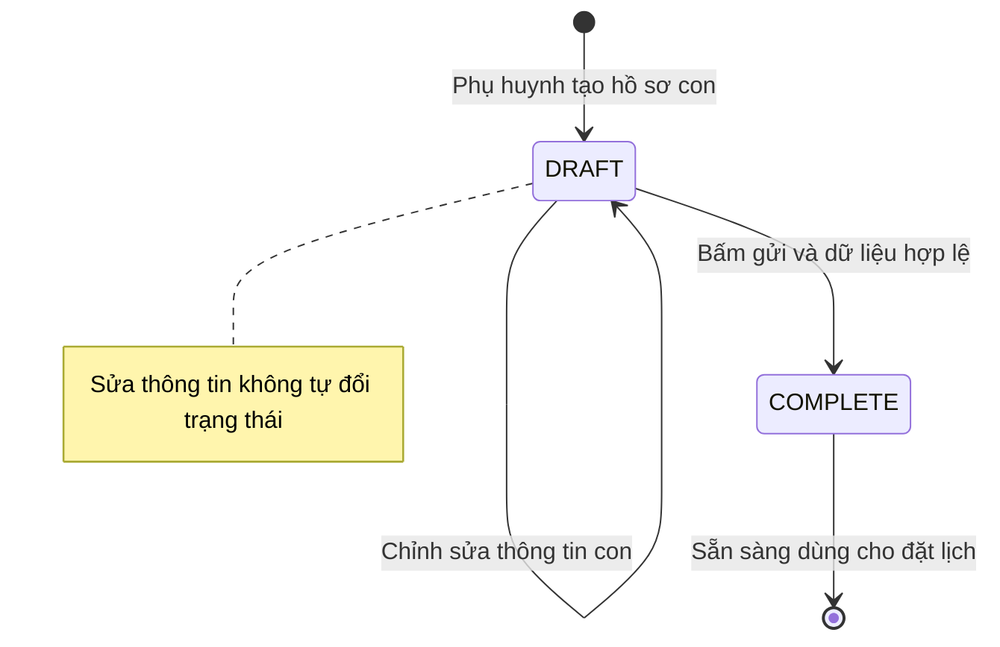
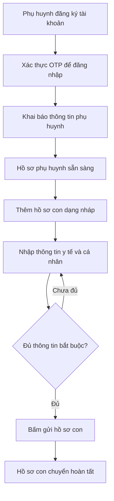
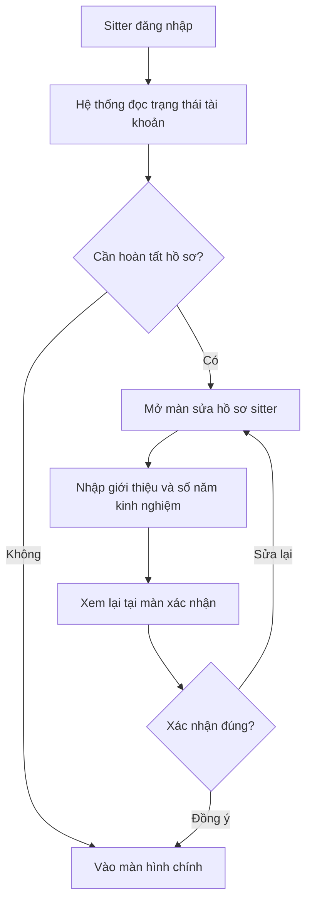

# Tài khoản & Hồ sơ — Sitter Navi

> Tài liệu nghiệp vụ (business/product) mô tả cách phụ huynh, người trông trẻ (sitter) và quản trị viên tạo và hoàn thiện hồ sơ trên nền tảng Sitter Navi. Trọng tâm là **vòng đời hồ sơ con** (nháp → hoàn tất) và **onboarding hồ sơ sitter**. Phần kỹ thuật được rút gọn và đặt ở cuối.

---

## Tổng quan

Sitter Navi là nền tảng kết nối gia đình với người trông trẻ tại Nhật. Trước khi một gia đình có thể đặt lịch, và trước khi một sitter có thể nhận việc, mỗi bên phải có **hồ sơ đầy đủ và đáng tin cậy**. Nhóm tính năng "Tài khoản & Hồ sơ" chính là bước nền móng đó.

Có ba loại hồ sơ chính:

- **Hồ sơ phụ huynh** — thông tin người giám hộ đứng tên tài khoản gia đình.
- **Hồ sơ con** — thông tin từng bé được gửi trông, gồm cả thông tin y tế và cá nhân nhạy cảm. Đây là dữ liệu quan trọng nhất để sitter chăm sóc bé an toàn.
- **Hồ sơ sitter** — thông tin giới thiệu bản thân và kinh nghiệm của người trông trẻ, do chính sitter tự khai và tự chỉnh sửa.

Điểm nghiệp vụ cốt lõi:

- **Hồ sơ con có 2 trạng thái**: `DRAFT` (nháp) và `COMPLETE` (hoàn tất). Phụ huynh nhập dần dần ở trạng thái nháp, chỉ khi đủ thông tin bắt buộc và bấm "gửi" mới chuyển sang hoàn tất. Chỉ hồ sơ con hoàn tất mới sẵn sàng dùng cho đặt lịch.
- **Sitter phải hoàn tất hồ sơ khi onboarding**: sau khi đăng nhập lần đầu, nếu hệ thống xác định sitter chưa hoàn tất hồ sơ, sitter bị dẫn thẳng vào màn sửa hồ sơ và phải qua bước xác nhận trước khi vào ứng dụng chính.
- **Tài khoản dùng chung một hệ**: phụ huynh và sitter là cùng một loại tài khoản người dùng, phân biệt bằng vai trò. Điều này giúp đăng nhập, bảo mật và thông báo dùng chung một cơ chế.

---

## Actors

| Actor | Vai trò | Nơi thao tác | Phạm vi với hồ sơ |
|---|---|---|---|
| Phụ huynh / Người giám hộ | Đứng tên tài khoản gia đình | App di động dành cho phụ huynh | Tự sửa hồ sơ phụ huynh của mình; tạo, sửa và gửi hồ sơ con; xem danh bạ liên hệ khẩn cấp |
| Sitter / Người trông trẻ (caregiver) | Người nhận việc chăm sóc | App di động dành cho sitter | Tự khai và tự sửa hồ sơ sitter của mình (kèm bước onboarding + xác nhận) |
| Quản trị viên / Vận hành (admin) | Đội vận hành Sitter Navi | Dashboard web quản trị | Xem và quản lý hồ sơ phụ huynh, hồ sơ con, hồ sơ sitter; quản lý danh bạ liên hệ khẩn cấp |

---

## Chức năng chính

**Hồ sơ phụ huynh**
- Phụ huynh xem và cập nhật thông tin cá nhân của chính mình (hồ sơ "của tôi").
- Hồ sơ phụ huynh lưu số con và độ tuổi các con để phục vụ gợi ý và thống kê.

**Hồ sơ con (trọng tâm)**
- Tạo hồ sơ con mới — luôn bắt đầu ở trạng thái **nháp (DRAFT)**.
- Nhập/chỉnh sửa dần: họ tên (kèm furigana), ngày sinh, giới tính, cùng nhiều **thông tin y tế và cá nhân** (ví dụ thân nhiệt bình thường của bé và các ghi chú chăm sóc).
- **Gửi hồ sơ (submit)**: hệ thống kiểm tra tính đầy đủ, nếu hợp lệ thì chuyển hồ sơ sang **hoàn tất (COMPLETE)**.
- Xóa hồ sơ con.
- Mỗi phụ huynh chỉ thao tác trên hồ sơ con của chính mình.

**Hồ sơ sitter (trọng tâm onboarding)**
- Sitter tự khai phần giới thiệu bản thân và số năm kinh nghiệm.
- **Luồng onboarding**: khi hệ thống yêu cầu "hoàn tất hồ sơ", sitter được đưa vào màn sửa hồ sơ ở chế độ onboarding, sau đó phải xem lại ở **màn xác nhận** rồi mới hoàn tất và vào ứng dụng.
- Sitter chỉ sửa được hồ sơ của chính mình.

**Liên hệ khẩn cấp**
- Danh bạ liên hệ khẩn cấp (tên, vai trò/bộ phận, số điện thoại) được đội vận hành quản lý; phía người dùng (app) chỉ **xem** danh bạ này, không tự thêm/sửa.

---

## Luồng nghiệp vụ

### Sơ đồ 1 — Vòng đời hồ sơ con: Nháp đến Hoàn tất

Đây là luồng quan trọng nhất của tài liệu. Hồ sơ con luôn được tạo ở trạng thái nháp, chỉnh sửa nhiều lần, và chỉ chuyển sang hoàn tất khi phụ huynh chủ động gửi và dữ liệu đủ hợp lệ. Thao tác chỉnh sửa thông thường **không** tự đổi trạng thái — trạng thái chỉ đổi qua bước gửi.

### Sơ đồ 2 — Phụ huynh hoàn thiện hồ sơ và thêm con

Từ lúc đăng ký đến khi có ít nhất một hồ sơ con hoàn tất. Bước nhập thông tin con có thể lặp lại nhiều lần cho tới khi đủ các trường bắt buộc.

### Sơ đồ 3 — Sitter hoàn tất hồ sơ khi onboarding

Sau khi đăng nhập, hệ thống kiểm tra trạng thái tài khoản sitter. Nếu cần hoàn tất hồ sơ, sitter bị dẫn qua màn sửa hồ sơ và bước xác nhận trước khi được vào màn hình chính.

---

## Màn hình & điểm chạm

| Nền tảng | Màn hình / điểm chạm | Mục đích |
|---|---|---|
| App phụ huynh | Hồ sơ phụ huynh — xem và chỉnh sửa | Xem và cập nhật thông tin người giám hộ |
| App phụ huynh | Danh sách con | Xem tất cả hồ sơ con và trạng thái nháp/hoàn tất |
| App phụ huynh | Thêm / sửa hồ sơ con | Nhập thông tin cơ bản, y tế và cá nhân của bé |
| App phụ huynh | Chi tiết hồ sơ con | Xem chi tiết một bé; điểm bấm gửi để hoàn tất |
| App sitter | Sửa hồ sơ sitter (kèm chế độ onboarding) | Khai giới thiệu và kinh nghiệm |
| App sitter | Màn xác nhận hồ sơ sitter | Xem lại trước khi hoàn tất onboarding |
| Dashboard admin | Quản lý phụ huynh (project management) | Vận hành xem/quản lý hồ sơ gia đình và con |
| Dashboard admin | Quản lý sitter (sitters management) | Vận hành xem/quản lý hồ sơ và thông tin sitter |

---

## Trạng thái hiện tại & Gaps

- **Hồ sơ con — nháp/hoàn tất**: đã có đầy đủ nghiệp vụ tạo (mặc định nháp), sửa (không đổi trạng thái), và gửi để hoàn tất. Đây là phần trưởng thành nhất của nhóm tính năng này.
- **Onboarding sitter**: app sitter có sẵn màn sửa hồ sơ ở chế độ onboarding và màn xác nhận, điều hướng theo yêu cầu "hoàn tất hồ sơ" mà hệ thống trả về sau đăng nhập.
- **Liên hệ khẩn cấp**: phía app hiện chỉ **xem** (read-only); mọi thao tác thêm/sửa/xóa nằm ở dashboard admin. Danh bạ này mang tính danh sách liên hệ tổ chức (tên, vai trò/bộ phận, số điện thoại) hơn là liên hệ khẩn cấp gắn riêng từng bé — *(cần xác nhận với nghiệp vụ liệu có cần liên hệ khẩn cấp theo từng con hay không)*.
- **Hồ sơ phụ huynh (điểm cần rà soát)**: app phụ huynh gọi tới endpoint hồ sơ phụ huynh "của tôi", nhưng theo ghi chú kỹ thuật, phần quản lý hồ sơ phụ huynh phía client dường như đang **tạm khóa/chưa đăng ký**. Cần xác nhận đường đi thực tế để hồ sơ phụ huynh được đọc/ghi ổn định *(cần xác nhận)*.
- **Điểm chạm "của tôi" cho hồ sơ**: cả phụ huynh và sitter đều dùng dạng hồ sơ "của tôi" để tự sửa; cần xác nhận thao tác này khớp với danh mục API hiện có (danh mục kỹ thuật chủ yếu liệt kê các thao tác danh sách/chi tiết chuẩn) *(cần xác nhận)*.

---

## Tham chiếu kỹ thuật (ngắn)

> Phần này dành cho kỹ thuật; người đọc nghiệp vụ có thể bỏ qua. Mọi đường dẫn dưới prefix `/api/v1/`.

- **Hồ sơ con**: `GET/POST/PATCH/DELETE /client/children` (giới hạn theo chủ sở hữu). Tạo mới **ép trạng thái = DRAFT**; cập nhật **loại bỏ trường trạng thái** (không cho đổi status qua sửa); gửi hoàn tất qua endpoint riêng `PATCH /client/children/:id/submit` (kiểm tra hợp lệ → chuyển `COMPLETE`). Trạng thái `Child.status` là enum `draft`/`complete` (native pg enum). Trường tiêu biểu: họ tên + furigana, ngày sinh, giới tính (`male`/`female`), nhiều trường y tế/cá nhân, `normalBodyTemperature` decimal(3,1).
- **Hồ sơ phụ huynh**: app dùng `client/parent-profiles/me`. Thực thể `parent_profile` khóa chính = `user_id`, gồm `childrenCount`, `childrenAges`. *(Lưu ý: controller `client/parent-profiles` được ghi nhận là đang comment/không đăng ký — cần xác nhận.)*
- **Hồ sơ sitter**: app dùng `client/sitter-profiles/me` (GET + PATCH). Thực thể `sitter_profile` khóa chính = `user_id`, gồm `introduction`, `experienceYears`. Cặp CRUD chuẩn `admin/sitter-profiles` + `client/sitter-profiles` có sẵn cho vận hành/đọc.
- **Liên hệ khẩn cấp**: `emergency_contact` (tên, `departmentRole`, `phoneNumber`); admin đủ 5 route CRUD, client **read-only**.
- **Onboarding sitter**: sau đăng nhập, app đọc `auth/me` để lấy hành động cần làm (require action). Giá trị `completeProfile` dẫn tới màn sửa hồ sơ sitter ở chế độ onboarding + màn xác nhận; `changePassword` dẫn tới đổi mật khẩu; còn lại vào app chính.
- **Đăng ký phụ huynh**: `POST /auth/register` (token onboarding), `POST /auth/register-info` (khai thông tin phụ huynh), đăng nhập kèm thử thách OTP.
- **Tài khoản chung**: phụ huynh và sitter cùng bảng `user`, phân biệt bằng `role` (`parent` / `caregiver` / `admin`).

> Nguồn đối chiếu: `backend/sitternavi-web-BE/overview/api-catalog.md`, `backend/sitternavi-web-BE/overview/erd.md`, structure của app phụ huynh, app sitter và dashboard web (quét repo 2026-07-02).
</content>
</invoke>
