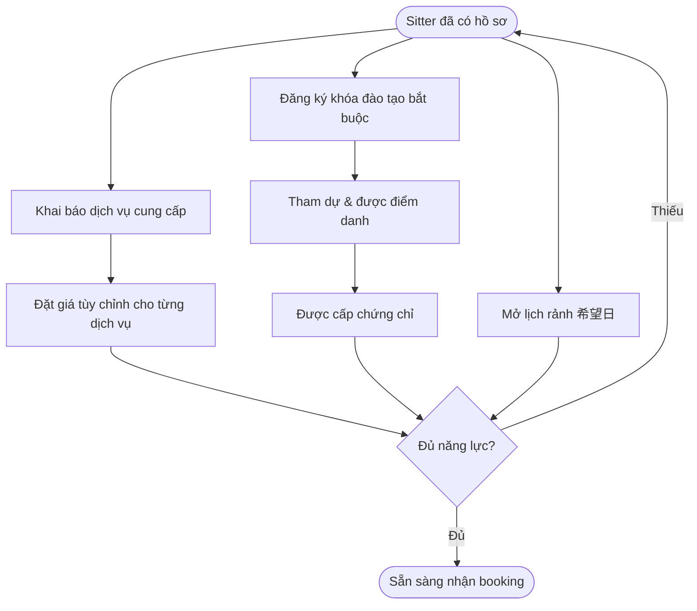
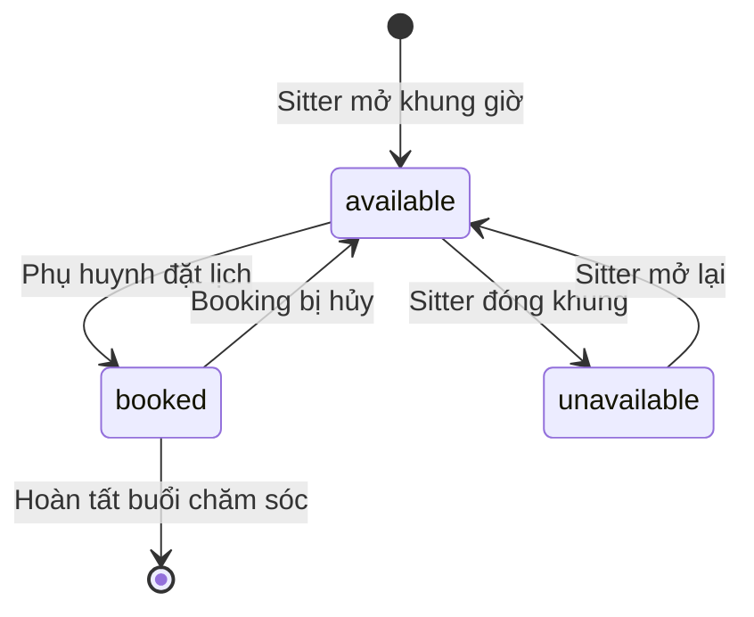
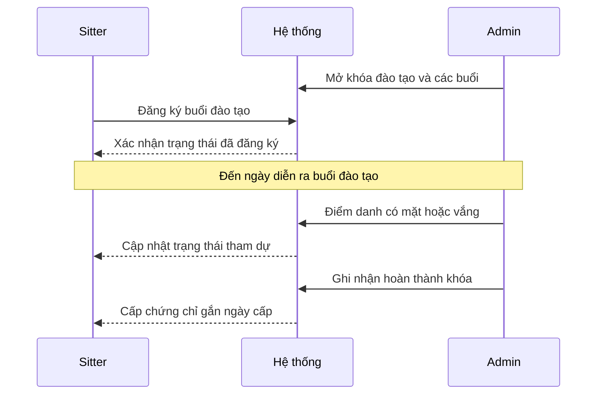

# Dịch vụ & Năng lực Sitter

> Mô tả **nghiệp vụ** (không phải kỹ thuật): sitter khai báo mình làm được **dịch vụ chăm sóc gì**, có **chứng chỉ** nào, tham gia **buổi đào tạo** ra sao, và mở **lịch rảnh** để nhận việc. Đây là nền tảng để hệ thống ghép sitter phù hợp với nhu cầu của phụ huynh. Tổng hợp ngược từ source code 2026-07-02.

---

## Tổng quan

Trước khi một sitter có thể nhận booking, hệ thống cần biết **năng lực** của sitter đó. Năng lực gồm 4 mảnh ghép:

1. **Dịch vụ cung cấp** — sitter chọn trong danh mục dịch vụ chăm sóc chung của hệ thống (ví dụ trông trẻ theo giờ, đưa đón...) những dịch vụ mình làm được, và có thể đặt **giá tùy chỉnh** riêng cho từng dịch vụ.
2. **Chứng chỉ** — bằng chứng sitter đã đủ điều kiện làm một loại việc. Chứng chỉ **không tự khai** mà được **cấp qua khóa đào tạo**: sitter tham dự đầy đủ buổi đào tạo của một khóa thì được ghi nhận chứng chỉ tương ứng.
3. **Đào tạo** — hệ thống mở các **khóa đào tạo** (có khóa bắt buộc), mỗi khóa có nhiều **buổi đào tạo** theo lịch cụ thể. Sitter đăng ký tham dự buổi đào tạo và được điểm danh.
4. **Lịch rảnh** — sitter mở các khung thời gian mình sẵn sàng làm việc; phụ huynh chỉ đặt được vào các khung này. Mỗi khung có trạng thái rảnh / đã đặt / không nhận.

**Ranh giới quyền:** Sitter **tự khai** dịch vụ cung cấp và **tự mở** lịch rảnh (qua app babysitter). **Admin/vận hành** quản lý danh mục dịch vụ nền, mở khóa & buổi đào tạo, và giám sát chứng chỉ (qua web dashboard). Chứng chỉ là kết quả của quá trình đào tạo, không phải tự khai.

> **Lưu ý phạm vi:** Tài liệu này mô tả *mô hình dữ liệu & màn hình đang có trong code*. Một số luật nghiệp vụ (ví dụ: có tự động cấp chứng chỉ khi điểm danh đủ hay admin cấp thủ công; điều kiện chuyển khung lịch sang "đã đặt") **chưa thấy quy tắc rõ ràng trong source** — được đánh dấu `(cần xác nhận)` ở phần Gaps.

---

## Actors

| Actor | Vai trò trong tính năng này | Công cụ |
|---|---|---|
| **Sitter (Caregiver)** | Khai báo dịch vụ cung cấp + giá tùy chỉnh; đăng ký & tham dự buổi đào tạo; mở/đóng lịch rảnh | App mobile `sitternavi-app-babysitter` |
| **Admin / Vận hành** | Quản lý danh mục dịch vụ chăm sóc; mở khóa & buổi đào tạo; theo dõi chứng chỉ, lịch rảnh, năng lực sitter | Web dashboard `sitternavi-web` (mục Sitters Management) |
| **Phụ huynh (Parent)** | Người thụ hưởng — chỉ thấy dịch vụ & khung rảnh của sitter khi tìm và đặt lịch (chi tiết ở tài liệu 04) | App mobile `sitternavi-app-parents` |

---

## Chức năng chính

| # | Chức năng | Ai làm | Mô tả nghiệp vụ |
|---|---|---|---|
| 1 | **Danh mục dịch vụ chăm sóc** | Admin | Danh sách dịch vụ chuẩn của hệ thống (mã + tên). Đây là "menu gốc" để sitter chọn và để phụ huynh đặt. |
| 2 | **Khai báo dịch vụ sitter** | Sitter | Sitter chọn từ danh mục các dịch vụ mình làm được; có thể đặt **giá tùy chỉnh** cho từng dịch vụ. Nếu không đặt, dùng giá chung. |
| 3 | **Quản lý khóa đào tạo** | Admin | Tạo khóa đào tạo (mã + tiêu đề), đánh dấu khóa **bắt buộc** hay không. |
| 4 | **Mở buổi đào tạo** | Admin | Mỗi khóa mở nhiều buổi đào tạo theo khung giờ cụ thể (thời gian bắt đầu / kết thúc). |
| 5 | **Đăng ký & điểm danh đào tạo** | Sitter + Admin | Sitter đăng ký buổi đào tạo; trạng thái tham dự: đã đăng ký → có mặt / vắng / đã hủy. |
| 6 | **Cấp chứng chỉ** | Admin (kết quả đào tạo) | Sau khi hoàn thành khóa đào tạo, sitter được ghi nhận chứng chỉ (gắn với khóa + ngày cấp). |
| 7 | **Quản lý lịch rảnh** | Sitter | Sitter mở các khung thời gian sẵn sàng làm việc; trạng thái: rảnh / đã đặt / không nhận. |

---

## Luồng nghiệp vụ

### Luồng 1 — Sitter thiết lập năng lực đầy đủ (tổng quan)

Toàn cảnh 4 mảnh ghép năng lực mà một sitter cần hoàn thiện để sẵn sàng nhận việc.

*Caption: Ba nhánh song song — dịch vụ + giá, đào tạo → chứng chỉ, và lịch rảnh — cùng hội tụ để sitter đủ điều kiện nhận việc.*

### Luồng 2 — Vòng đời một khung lịch rảnh

Một khung thời gian sitter mở ra sẽ chuyển trạng thái theo việc có được đặt hay không.

*Caption: Khung rảnh (available) là điểm phụ huynh có thể đặt; khi đặt xong chuyển sang đã đặt (booked); sitter có thể tự đóng thành không nhận (unavailable). (cần xác nhận: điều kiện tự động chuyển available → booked do hệ thống booking quản lý.)*

### Luồng 3 — Đăng ký đào tạo → hoàn thành → cấp chứng chỉ

Trình tự giữa sitter, hệ thống và admin từ lúc đăng ký buổi đào tạo đến khi có chứng chỉ.

*Caption: Chứng chỉ là đầu ra cuối chuỗi đào tạo; sitter không tự khai chứng chỉ. (cần xác nhận: cấp chứng chỉ là thao tác admin thủ công hay tự động khi điểm danh đủ.)*

---

## Màn hình & điểm chạm

| Nền tảng | Màn hình / khu vực | Ai dùng | Làm gì |
|---|---|---|---|
| App babysitter | `edit_sitter_profile` (Sửa hồ sơ sitter + confirm) | Sitter | Hoàn tất hồ sơ, nền tảng để khai báo năng lực khi onboarding |
| App babysitter | `work_schedule` (予約・研修 + 希望日一覧, lịch tháng) | Sitter | Xem lịch làm việc gộp booking + buổi đào tạo (研修) + danh sách ngày mong muốn |
| App babysitter | `shift_register` (Đăng ký ca / 希望日 + confirm) | Sitter | Mở khung thời gian rảnh (đăng ký ngày mong muốn làm việc) |
| Web dashboard | Sitters Management → chi tiết sitter `[id]` → **qualification** | Admin | Xem/quản lý chứng chỉ & năng lực (qualification) của sitter |
| Web dashboard | Sitters Management → chi tiết sitter `[id]` → **calendar** | Admin | Xem lịch rảnh / lịch làm việc của sitter |
| Web dashboard | Sitters Management (danh sách + mời sitter) | Admin | Quản lý danh sách sitter, điều phối năng lực |

> Ghi chú: App babysitter hiển thị mặc định tiếng Nhật (研修 = đào tạo, 希望日 = ngày mong muốn làm việc). Màn `work_schedule` dùng lịch tháng gộp cả booking và buổi đào tạo để sitter thấy toàn bộ lịch của mình.

---

## Trạng thái hiện tại & Gaps

**Đang có trong hệ thống:**
- Danh mục dịch vụ chăm sóc chung (admin quản lý) + sitter chọn dịch vụ cung cấp với giá tùy chỉnh tùy chọn.
- Khóa đào tạo (có cờ bắt buộc) + buổi đào tạo theo lịch; sitter đăng ký buổi đào tạo với trạng thái đã đăng ký / có mặt / vắng / đã hủy.
- Chứng chỉ gắn với khóa đào tạo + ngày cấp.
- Lịch rảnh với trạng thái rảnh / đã đặt / không nhận.
- API admin + client cho tất cả các mục trên; màn web (qualification, calendar) và màn app (work_schedule, shift_register).

**Gaps / cần xác nhận:**
- **Cấp chứng chỉ:** chưa thấy quy tắc tự động cấp khi điểm danh đủ — có thể là thao tác admin thủ công `(cần xác nhận)`.
- **Chuyển khung lịch available → booked:** do luồng booking điều khiển; ràng buộc chính xác nằm ngoài phạm vi tài liệu này `(cần xác nhận)`.
- **Ràng buộc "bắt buộc có chứng chỉ mới nhận việc":** khóa đào tạo có cờ *bắt buộc* nhưng chưa rõ hệ thống có chặn nhận booking khi sitter thiếu chứng chỉ bắt buộc hay không `(cần xác nhận)`.
- **Giá tùy chỉnh vs giá chung:** quan hệ giữa giá tùy chỉnh của sitter và bảng giá theo gói thành viên (service-price) thuộc tài liệu 06 — cần đối chiếu để tránh mâu thuẫn `(cần xác nhận)`.
- App babysitter hiện chỉ thấy endpoint `sitter/working-patterns` (đăng ký 希望日) và `sitter/calendar/events`; các thao tác chi tiết về dịch vụ/chứng chỉ trên app `(cần xác nhận)`.

---

## Tham chiếu kỹ thuật (ngắn)

> Dành cho người đọc kỹ thuật. Chi tiết đầy đủ xem `backend/sitternavi-web-BE/overview/{api-catalog,erd}.md`.

**Bảng dữ liệu (ERD — mục Sitter + Care/Training):**
- `sitter_service` — dịch vụ sitter cung cấp: `sitterId`, `serviceId`, `customPrice` (nullable).
- `sitter_certification` — chứng chỉ: `sitterId`, `courseId`, `issuedAt`.
- `sitter_availability` — lịch rảnh: `sitterId`, `startTime`, `endTime`, `status` (available / booked / unavailable).
- `care_service` — danh mục dịch vụ chuẩn: `code`, `name`.
- `training_course` — khóa đào tạo: `code`, `title`, `isRequired`.
- `training_session` — buổi đào tạo: `courseId`, `startTime`, `endTime`.
- `sitter_training_session` — đăng ký của sitter: `sitterId`, `trainingSessionId`, `status` (registered / attended / absent / cancelled).

**API (đều dưới `/api/v1/`, mỗi module có cặp admin `admin/...` + client `client/...`, chuẩn CRUD 5 route):**
`care-services`, `sitter-services`, `sitter-certifications`, `sitter-availabilities`, `training-courses`, `training-sessions`, `sitter-training-sessions`.

**App babysitter (endpoint đặc thù):** `GET api/v1/sitter/calendar/events` (query `from/to/mode`), `POST api/v1/sitter/working-patterns` (希望日登録).

**Màn hình:** Web — `sitters-management/[id]/{qualification,calendar}`. App — `features/{edit_sitter_profile, work_schedule, shift_register}`.
