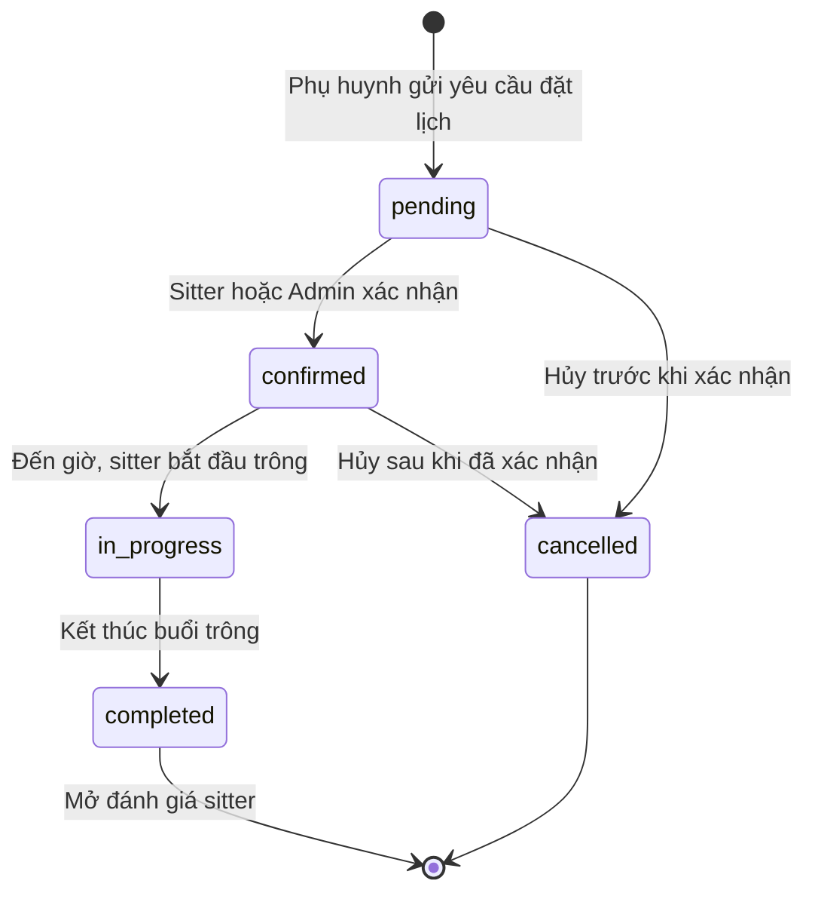
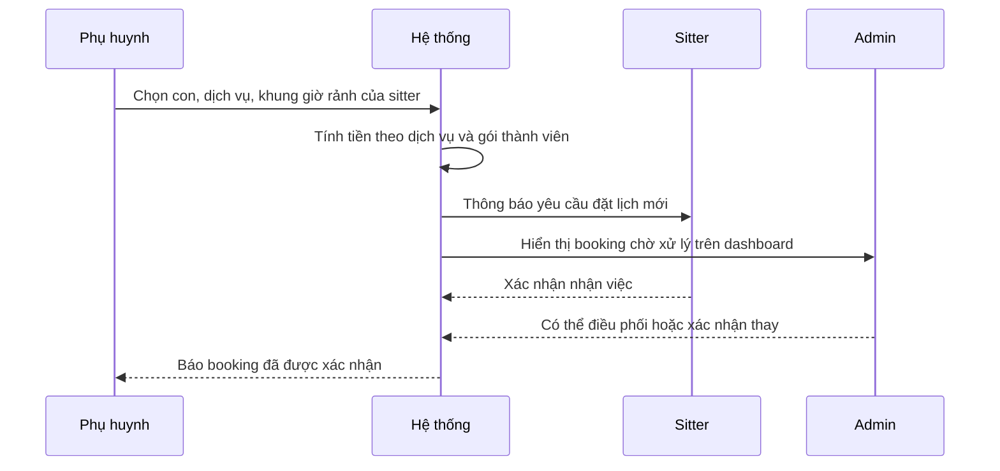
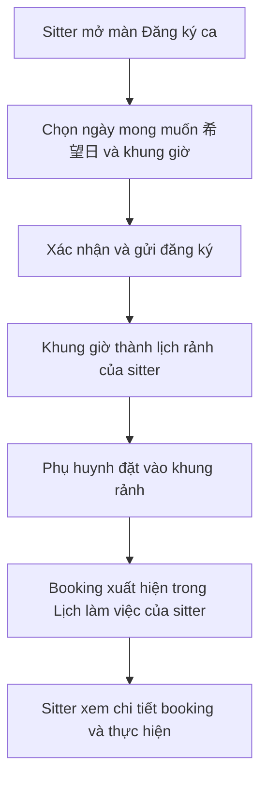
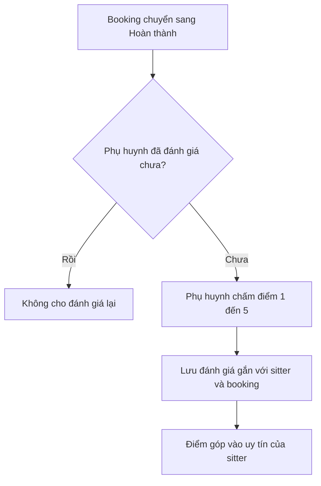

# Đặt lịch & Xếp ca

> Tính năng cốt lõi kết nối cung – cầu của Sitter Navi: **sitter khai báo thời gian rảnh / ngày mong muốn làm việc (希望日)**, **phụ huynh đặt lịch trông con**, hệ thống theo dõi **vòng đời của mỗi lần đặt (booking)** từ lúc yêu cầu đến khi hoàn thành, và cuối cùng **phụ huynh đánh giá sitter**. Tài liệu này viết cho product/business — mô tả *làm gì* và *tại sao*; chi tiết kỹ thuật gói ở cuối.

## Tổng quan

Đây là "trái tim" vận hành của nền tảng — nơi thời gian rảnh của sitter gặp nhu cầu của phụ huynh.

- **Vì sao cần:** Một nền tảng trông trẻ chỉ có giá trị khi ghép đúng người trông trẻ vào đúng khung giờ gia đình cần. Tính năng này biến "sitter có lịch trống" và "phụ huynh cần người" thành một lần đặt cụ thể, có trạng thái rõ ràng, có tiền và có chất lượng được đo lường.
- **Bốn mảnh ghép chính:**
  1. **Sitter đăng ký ca rảnh / ngày mong muốn (希望日)** và xem lịch làm việc của mình.
  2. **Phụ huynh đặt booking** cho một hoặc nhiều con, kèm một hoặc nhiều dịch vụ chăm sóc, gắn với khung rảnh của sitter và gói thành viên đang có.
  3. **Vòng đời booking**: chờ xác nhận → đã xác nhận → đang diễn ra → hoàn thành, hoặc bị hủy.
  4. **Đánh giá sitter** sau khi booking hoàn thành (chấm điểm 1–5).
- **Ai điều phối:** Đội vận hành (Admin) giám sát và có thể can thiệp qua web dashboard (quản lý job, project, lịch của sitter).

## Actors

| Actor | Vai trò trong tính năng này | Công cụ |
|---|---|---|
| **Phụ huynh (Parent)** | Đặt lịch trông con, chọn khung giờ + dịch vụ, đánh giá sau khi xong | App mobile `sitternavi-app-parents` |
| **Sitter (Caregiver)** | Đăng ký ca rảnh / 希望日, xem lịch làm việc, xem chi tiết booking được giao | App mobile `sitternavi-app-babysitter` |
| **Admin / Vận hành** | Điều phối job, theo dõi project & lịch sitter, xử lý ngoại lệ (hủy, đổi ca) | Web dashboard `sitternavi-web` |
| **Hệ thống** | Lưu trạng thái booking, khớp khung rảnh, tính tiền, ghi nhận đánh giá | Backend |

## Chức năng chính

| # | Chức năng | Mô tả nghiệp vụ | Ai dùng |
|---|---|---|---|
| 1 | **Đăng ký ca rảnh / 希望日** | Sitter khai báo những khung giờ / ngày mình sẵn sàng làm việc | Sitter |
| 2 | **Xem lịch làm việc** | Sitter xem lịch tháng gồm booking đã nhận, buổi đào tạo (研修) và danh sách 希望日 đã đăng ký | Sitter |
| 3 | **Đặt booking** | Phụ huynh tạo yêu cầu trông con: chọn con, dịch vụ, khung giờ của sitter | Phụ huynh |
| 4 | **Gắn nhiều con vào 1 booking** | Một lần đặt có thể trông nhiều con cùng lúc | Phụ huynh |
| 5 | **Gắn nhiều dịch vụ vào 1 booking** | Một booking có thể gồm nhiều loại dịch vụ chăm sóc, mỗi dịch vụ có đơn giá riêng | Phụ huynh / Hệ thống |
| 6 | **Áp gói thành viên** | Giá booking chịu ảnh hưởng của gói thành viên phụ huynh đang giữ (giảm giá, đơn giá theo gói) | Hệ thống |
| 7 | **Theo dõi vòng đời booking** | Trạng thái chuyển từ chờ xác nhận → xác nhận → đang diễn ra → hoàn thành / hủy | Tất cả |
| 8 | **Xem chi tiết booking** | Sitter xem thông tin buổi trông (con, dịch vụ, thời gian, địa điểm) | Sitter |
| 9 | **Đánh giá sitter** | Sau khi booking hoàn thành, phụ huynh chấm điểm 1–5 cho sitter | Phụ huynh |
| 10 | **Điều phối & giám sát** | Admin quản lý job / project / lịch sitter, can thiệp khi cần | Admin |

## Luồng nghiệp vụ

### Luồng 1 — Vòng đời của một booking

Mỗi lần đặt lịch đi qua các trạng thái sau. "Đã hoàn thành" mở ra bước đánh giá; "Đã hủy" là điểm kết thúc thay thế có thể xảy ra khi còn chờ hoặc đã xác nhận.

### Luồng 2 — Phụ huynh đặt lịch và khớp với lịch sitter

Từ lúc phụ huynh chọn khung giờ đến khi booking được xác nhận.

### Luồng 3 — Sitter đăng ký 希望日 và nhận việc

Sitter chủ động khai báo thời gian sẵn sàng; các khung này trở thành nguồn để phụ huynh đặt vào.

### Luồng 4 — Đánh giá sitter sau khi hoàn thành

Đánh giá chỉ mở sau khi buổi trông kết thúc, và mỗi booking chỉ có một đánh giá.

## Màn hình & điểm chạm

| Nền tảng | Màn hình / khu vực | Vai trò trong tính năng |
|---|---|---|
| App Sitter (`sitternavi-app-babysitter`) | **Đăng ký ca** (`shift_register` + màn xác nhận) | Khai báo 希望日 / khung giờ rảnh |
| App Sitter | **Lịch làm việc** (`work_schedule`, lịch tháng) | Xem booking đã nhận, buổi đào tạo (研修), danh sách 希望日 |
| App Sitter | **Chi tiết booking** (`booking_detail`) | Xem thông tin buổi trông được giao |
| App Sitter | **Trang chủ** (`home`) | Điểm vào nhanh tới lịch và công việc |
| App Phụ huynh (`sitternavi-app-parents`) | **Trang chủ** (`home`), **Quản lý con** (`children`) | Xuất phát điểm để đặt lịch và chọn con (màn đặt lịch riêng: cần xác nhận) |
| Web Admin (`sitternavi-web`) | **Jobs Management** (`jobs-management`) | Quản lý / tạo job thủ công cho sitter |
| Web Admin | **Project Management** (`project-management`) | Theo dõi project / booking của gia đình |
| Web Admin | **Sitter Management → Calendar** (`sitters-management/[id]/calendar`) | Xem lịch của từng sitter |
| Web Admin | **Reservation Management** (`/reservations`) | Màn quản lý đặt lịch — đã dành chỗ trong menu nhưng chưa dựng (cần xác nhận) |

## Trạng thái hiện tại & Gaps

- **Nền tảng backend đã sẵn sàng đầy đủ:** vòng đời booking (5 trạng thái), gắn nhiều con và nhiều dịch vụ, gắn khung rảnh của sitter, gắn gói thành viên, và đánh giá 1–5 đều đã có trong dữ liệu và API.
- **Đăng ký 希望日 và lịch làm việc phía sitter đã có** (màn `shift_register`, `work_schedule`, `booking_detail` trong app babysitter).
- **Màn đặt lịch phía phụ huynh:** app parents hiện có trang chủ và quản lý con, **nhưng chưa thấy màn "đặt booking" riêng** trong cấu trúc app (cần xác nhận đã dựng hay chưa). Backend đã hỗ trợ đặt lịch phía client.
- **Reservation Management trên web admin** mới là route dành sẵn trong menu, **chưa có trang thực tế** (cần xác nhận roadmap).
- **Cách ép chuyển trạng thái booking** (pending → confirmed → …): chưa thấy endpoint chuyên biệt cho từng bước chuyển; hiện có thể đi qua thao tác cập nhật chung. Quy tắc ai được chuyển trạng thái nào, khi nào — cần xác nhận với team backend.
- **Chấm công (check-in/out)** gắn với booking nhưng thuộc tính năng **05 — Check-in & Chăm sóc**, không nằm trong phạm vi tài liệu này.

## Tham chiếu kỹ thuật (ngắn)

> Phần này dành cho engineer. Nguồn: API catalog + ERD backend (scan 2026-07-02).

- **Dữ liệu chính:**
  - `booking` — gồm `parentId`, `sitterId`, `availabilityId`, `membershipPlanId` (nullable), các cột tiền (`baseAmount` / `serviceAmount` / `discountAmount` / `totalAmount`), `status` ∈ `pending` / `confirmed` / `in_progress` / `completed` / `cancelled`.
  - `booking_child` — bảng nối (composite PK `booking_id` + `child_id`) → một booking gắn nhiều con.
  - `booking_service` — nhiều dịch vụ / booking, mỗi dòng có `unitPrice` + `subtotal`; tham chiếu `care_service`.
  - `sitter_availability` — `sitterId`, `startTime`, `endTime`, `status` ∈ `available` / `booked` / `unavailable`.
  - `review` — quan hệ 1:1 với booking; `rating` int 1–5, gắn `parentId` + `sitterId`.
  - `membership_plan` / `service_price` — ảnh hưởng giá booking.
- **API (đều dưới `/api/v1/`):**
  - Booking CRUD: `client/bookings` (phụ huynh, owner-scoped) + `admin/bookings` (admin).
  - Review CRUD: `client/reviews` + `admin/reviews`.
  - Lịch rảnh sitter CRUD: `client/sitter-availabilities` + `admin/sitter-availabilities`.
  - App Sitter dùng endpoint riêng: `GET api/v1/sitter/calendar/events` (query `from` / `to` / `mode`) cho lịch làm việc, `POST api/v1/sitter/working-patterns` cho đăng ký 希望日.
- **Lưu ý:** chưa có endpoint transition trạng thái booking chuyên biệt trong catalog (cần xác nhận); chuyển trạng thái hiện có thể qua `PATCH` chung.
