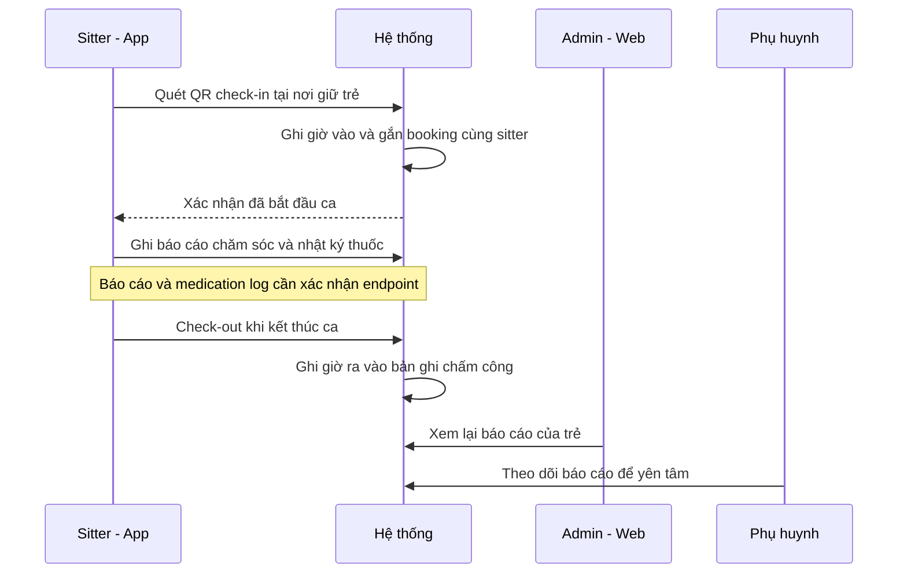
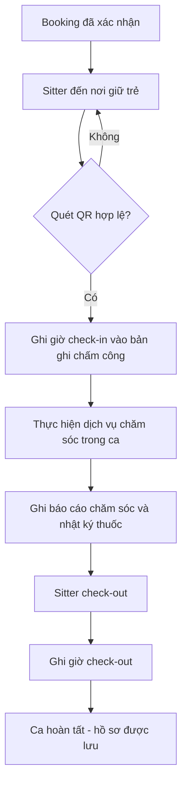
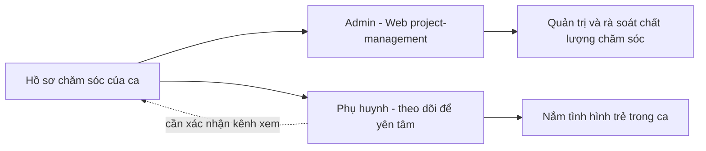

# Chấm công & Chăm sóc trong ca — Check-in QR đến Check-out

> Tài liệu nghiệp vụ/sản phẩm cho Sitter Navi. Giải thích cách một buổi chăm sóc trẻ được ghi nhận từ lúc sitter đến nơi quét mã QR để check-in, chấm công trong suốt ca, ghi lại báo cáo chăm sóc, đến khi kết thúc ca. Mục tiêu: minh bạch giờ làm và tạo hồ sơ chăm sóc để phụ huynh yên tâm. Phần kỹ thuật được rút gọn tối đa và đặt ở cuối.

---

## Tổng quan

Khi một booking (đặt lịch giữ trẻ) đã được xác nhận, sitter sẽ đến nhà phụ huynh theo lịch. Tại đó, thay vì tự khai giờ, sitter **quét mã QR để check-in** — hệ thống tự ghi lại mốc giờ bắt đầu ca. Trong suốt ca, người chăm sóc thực hiện các dịch vụ đã đặt và có thể ghi nhận **báo cáo chăm sóc** (care report) cùng **nhật ký cho thuốc** (medication log) để phụ huynh và trung tâm nắm được tình hình của trẻ. Khi ca kết thúc, sitter **check-out** — hệ thống ghi mốc giờ kết thúc.

Giá trị mang lại:

- **Minh bạch giờ làm:** mốc check-in / check-out do hệ thống ghi, gắn chặt với đúng booking và đúng sitter — làm cơ sở tin cậy cho tính công, đối soát và thanh toán.
- **Phụ huynh yên tâm:** hồ sơ chăm sóc trong ca (trẻ ăn/ngủ/vui chơi ra sao, có cho uống thuốc không) được lưu lại, không phụ thuộc trí nhớ hay lời kể miệng.
- **Chống gian lận / nhầm ca:** check-in bằng QR tại hiện trường khó khai khống hơn so với tự nhập giờ.

---

## Actors

| Actor | Vai trò trong luồng | Kênh sử dụng |
|---|---|---|
| **Sitter (người chăm sóc / caregiver)** | Quét QR check-in, thực hiện dịch vụ chăm sóc, ghi báo cáo, check-out | App mobile dành cho sitter |
| **Phụ huynh (parent)** | Người có trẻ được chăm sóc; theo dõi báo cáo chăm sóc để yên tâm | App/kênh của phụ huynh *(cần xác nhận cách phụ huynh xem báo cáo)* |
| **Admin / Trung tâm điều phối** | Quản lý booking, theo dõi và quản trị báo cáo chăm sóc của từng trẻ | Web quản trị `project-management` |
| **Hệ thống** | Tự ghi mốc chấm công vào bản ghi chấm công, gắn với booking + sitter | Backend |

---

## Chức năng chính

| # | Chức năng | Mô tả nghiệp vụ | Trạng thái |
|---|---|---|---|
| 1 | **Check-in bằng QR** | Sitter đến nơi, mở màn quét QR để bắt đầu ca; hệ thống ghi mốc giờ vào | App sitter có màn quét QR |
| 2 | **Chấm công (bản ghi attendance)** | Mỗi ca có một bản ghi chấm công lưu giờ vào / giờ ra, gắn với đúng booking và đúng sitter | Có bản ghi chấm công ở backend |
| 3 | **Danh mục dịch vụ chăm sóc** | Các loại dịch vụ chăm sóc chuẩn hoá để gắn vào booking | Có danh mục dịch vụ chăm sóc |
| 4 | **Báo cáo chăm sóc (care report)** | Ghi lại diễn biến chăm sóc của trẻ trong ca | Có màn trên web quản trị *(cần xác nhận endpoint)* |
| 5 | **Nhật ký cho thuốc (medication log)** | Ghi lại việc cho trẻ uống thuốc trong ca | Suy từ tên màn web *(cần xác nhận)* |
| 6 | **Check-out** | Sitter kết thúc ca; hệ thống ghi mốc giờ kết thúc | Bổ sung mốc giờ ra vào bản ghi chấm công |
| 7 | **Xem báo cáo** | Phụ huynh và admin xem lại hồ sơ chăm sóc của trẻ | Admin xem qua web; phụ huynh *(cần xác nhận)* |

---

## Luồng nghiệp vụ

### Luồng 1 — Trình tự một ca: Check-in → Chăm sóc → Check-out

*Sitter quét QR để bắt đầu, hệ thống ghi chấm công, ghi báo cáo trong ca, rồi kết thúc.*

### Luồng 2 — Vòng đời một ca chăm sóc từ đầu tới cuối

*Từ booking đã xác nhận đến khi ca hoàn tất và hồ sơ được lưu.*

### Luồng 3 — Ai xem được báo cáo chăm sóc

*Sau khi ca kết thúc, hồ sơ chăm sóc phục vụ hai nhóm người xem.*

---

## Màn hình & điểm chạm

| Điểm chạm | Nơi | Actor | Ghi chú |
|---|---|---|---|
| Màn quét QR check-in | App sitter — màn `scan_qr` | Sitter | Dùng camera quét mã QR để bắt đầu ca |
| Chi tiết booking | App sitter — màn `booking_detail` | Sitter | Xem thông tin ca trước/trong khi chăm sóc |
| Báo cáo chăm sóc của trẻ | Web quản trị — `project-management` › chi tiết › `children/[childId]/care-report` | Admin | Xem/quản trị báo cáo theo từng trẻ *(cần xác nhận endpoint)* |
| Nhật ký cho thuốc | Web quản trị — khu `medication-log` trong quản lý trẻ | Admin | Suy từ tên màn *(cần xác nhận)* |
| Xem báo cáo phía phụ huynh | Kênh phụ huynh | Phụ huynh | *(cần xác nhận cách phụ huynh truy cập)* |

---

## Trạng thái hiện tại & Gaps

- **Đã có nền tảng chấm công:** hệ thống có bản ghi chấm công lưu giờ vào (check-in) và giờ ra (check-out), gắn 1-1 với booking và gắn với sitter. Giờ ra để trống cho đến khi check-out.
- **Đã có màn quét QR trên app sitter** (`scan_qr`) phục vụ check-in tại hiện trường.
- **Đã có danh mục dịch vụ chăm sóc** (care-service) để chuẩn hoá loại dịch vụ gắn vào booking.
- **Gap — Báo cáo chăm sóc & nhật ký thuốc:** hiện chỉ thấy **màn trên web quản trị** (`care-report`, và `medication-log` suy từ tên thư mục). **Chưa xác nhận** có endpoint/bảng dữ liệu riêng cho care report và medication log — cần làm rõ dữ liệu này được lưu ở đâu và ai nhập (sitter trên app hay admin trên web). **(cần xác nhận)**
- **Gap — Kênh xem của phụ huynh:** chưa rõ phụ huynh xem báo cáo chăm sóc qua kênh nào. **(cần xác nhận)**
- **Gap — Liên kết QR ↔ booking:** chưa xác nhận mã QR mã hoá thông tin gì và quy tắc đối chiếu để xác thực đúng ca/đúng địa điểm. **(cần xác nhận)**

---

## Tham chiếu kỹ thuật (ngắn)

> Chỉ dành cho người đọc kỹ thuật. Nguồn: ERD + API Catalog backend, scan 2026-07-02.

- **Chấm công:** thực thể `attendance_log` — `booking_id`, `sitter_id`, `check_in_at`, `check_out_at` (để trống tới khi check-out). Quan hệ 1-1 với `booking`, gắn với `user` (sitter). API CRUD chuẩn: `admin/attendance-logs` và `client/attendance-logs` (dưới `/api/v1/`).
- **Booking:** trạng thái gồm `pending / confirmed / in_progress / completed / cancelled`.
- **Dịch vụ chăm sóc:** thực thể `care_service` (`code`, `name`); gắn vào booking qua `booking_service`. API: `admin/care-services`, `client/care-services`.
- **App sitter (Flutter):** feature `scan_qr` dùng `mobile_scanner` cho check-in; feature `booking_detail` hiển thị chi tiết ca.
- **Web quản trị (React):** `project-management/[id]/children/[childId]/care-report` (và khu `medication-log`) — hiện là màn UI; **chưa xác nhận endpoint backend tương ứng cho care report / medication log**.
</content>
</invoke>
