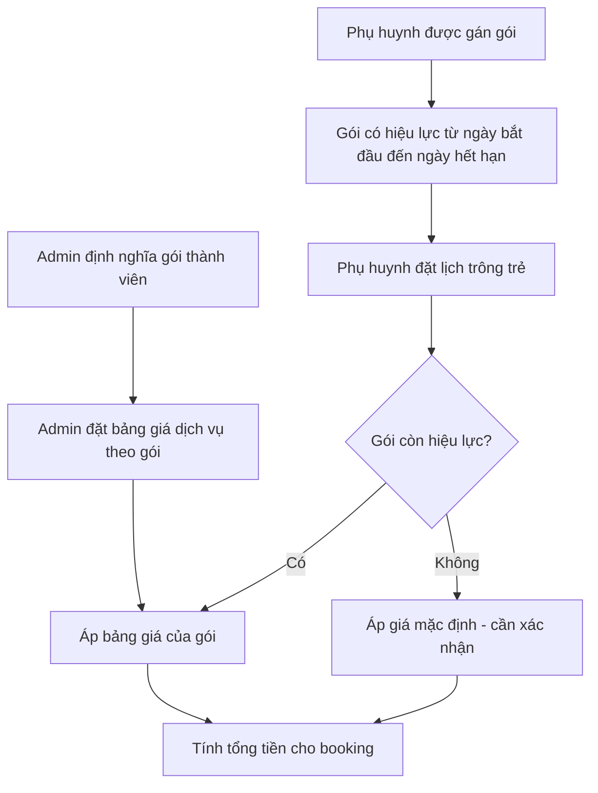
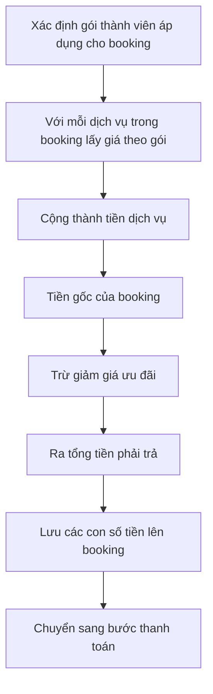

# Gói thành viên & Giá dịch vụ

> Tài liệu **nghiệp vụ** mô tả cách Sitter Navi định giá dịch vụ trông trẻ thông qua **gói thành viên (membership)**. Phụ huynh có thể đăng ký một gói thành viên trong một khoảng thời gian; gói đó quyết định **mức giá và ưu đãi** áp dụng khi họ đặt lịch (booking). Tổng hợp ngược từ source code — phần logic áp giá được đánh dấu **(cần xác nhận)** vì hiện chỉ suy luận từ cấu trúc dữ liệu.

## Tổng quan

Sitter Navi không dùng một bảng giá cố định cho tất cả mọi người. Thay vào đó, giá của mỗi dịch vụ chăm sóc phụ thuộc vào **gói thành viên** mà phụ huynh đang sở hữu.

Ba khối nghiệp vụ chính:

- **Gói thành viên (Membership Plan):** danh mục các gói do đội vận hành định nghĩa (ví dụ: gói phổ thông, gói ưu đãi). Mỗi gói là một "hạng" khách hàng.
- **Đăng ký gói của phụ huynh (Parent Membership):** ghi nhận việc một phụ huynh sở hữu một gói, **có thời hạn hiệu lực** từ ngày bắt đầu đến ngày hết hạn. Ngoài khoảng này, gói không còn tác dụng.
- **Bảng giá theo gói (Service Price):** với mỗi **dịch vụ chăm sóc** (care service) và mỗi **gói thành viên**, hệ thống lưu một mức giá riêng. Cùng một dịch vụ có thể có giá khác nhau tùy gói.

Giá trị mang lại: gói thành viên là đòn bẩy để đội vận hành (1) thưởng cho khách hàng trung thành bằng giá tốt hơn, (2) điều chỉnh giá linh hoạt theo từng nhóm khách mà không phải sửa từng booking, và (3) minh bạch hóa chi phí trước khi phụ huynh đặt lịch.

## Actors

| Actor | Vai trò trong tính năng này | Dùng gì |
|---|---|---|
| **Phụ huynh (Parent)** | Sở hữu gói thành viên có thời hạn; được áp giá & ưu đãi khi đặt lịch | App mobile phụ huynh |
| **Admin / Vận hành** | Tạo & quản lý danh mục gói, bảng giá dịch vụ theo gói, và đăng ký gói cho phụ huynh | Web dashboard `sitternavi-web` |
| **Hệ thống đặt lịch (Booking)** | Khi tạo booking, tra gói đang hiệu lực → lấy giá dịch vụ tương ứng → tính tổng tiền | Tự động (backend) |

## Chức năng chính

- **Quản lý danh mục gói thành viên:** admin tạo, sửa, ngừng các gói (mỗi gói có mã và tên).
- **Quản lý bảng giá theo gói:** admin đặt giá cho từng cặp *dịch vụ chăm sóc × gói thành viên*. Đây là nơi định nghĩa "dịch vụ A trong gói B có giá bao nhiêu".
- **Gán gói cho phụ huynh:** ghi nhận phụ huynh đang thuộc gói nào, hiệu lực từ ngày nào đến ngày nào.
- **Áp giá khi đặt lịch:** lúc phụ huynh đặt booking, hệ thống xác định gói đang hiệu lực và dùng bảng giá của gói đó để tính tiền dịch vụ, khấu trừ ưu đãi, ra tổng tiền phải trả **(cần xác nhận)**.
- **Lưu vết giá trên từng booking:** mỗi booking lưu lại các con số tiền (tiền gốc, tiền dịch vụ, giảm giá, tổng) để đối soát và thanh toán về sau.

## Luồng nghiệp vụ

### Sơ đồ 1 — Phụ huynh sở hữu gói và gói được áp dụng khi đặt lịch

*Chú thích: Gói thành viên chỉ có tác dụng trong khoảng thời gian hiệu lực. Khi phụ huynh đặt lịch, hệ thống kiểm tra gói còn hạn hay không rồi mới quyết định bảng giá áp dụng. Nhánh "áp giá mặc định" khi hết hạn hiện là suy luận, cần xác nhận với đội phát triển.*

### Sơ đồ 2 — Cách tính giá cho một booking

*Chú thích: Mỗi booking lưu bốn con số — tiền gốc, tiền dịch vụ, giảm giá, và tổng. Giá của từng dịch vụ được lấy từ bảng giá theo gói. Trình tự và công thức cụ thể (thứ tự cộng/trừ, nguồn của giảm giá) hiện suy luận từ cấu trúc dữ liệu — **(cần xác nhận)**.*

## Màn hình & điểm chạm

| Điểm chạm | Ai dùng | Mô tả |
|---|---|---|
| Danh mục gói thành viên | Admin | Tạo/sửa/ngừng các gói (mã, tên) |
| Bảng giá dịch vụ theo gói | Admin | Đặt giá cho từng cặp dịch vụ × gói |
| Đăng ký gói cho phụ huynh | Admin | Gán gói + khoảng thời gian hiệu lực cho từng phụ huynh |
| Xem gói của tôi | Phụ huynh | Hiển thị gói đang sở hữu và thời hạn (nếu có màn hình tương ứng — **cần xác nhận**) |
| Màn hình đặt lịch | Phụ huynh | Nơi giá theo gói được áp và tổng tiền hiển thị trước khi xác nhận |

## Trạng thái hiện tại & Gaps

- **Đã có (ở tầng dữ liệu & API):** danh mục gói thành viên, đăng ký gói của phụ huynh (có ngày bắt đầu/hết hạn), bảng giá dịch vụ theo gói, và các trường tiền trên booking (tiền gốc/dịch vụ/giảm giá/tổng). Booking có tham chiếu tới gói thành viên áp dụng.
- **Chỉ suy luận, cần xác nhận:**
  - Logic áp giá tự động khi đặt lịch (chọn gói còn hiệu lực → tra bảng giá → tính tổng) — hiện suy ra từ quan hệ giữa các bảng, chưa thấy endpoint tính giá riêng.
  - Nguồn và cách tính **giảm giá (discount)**: gói quyết định giảm giá như thế nào, có phải phần trăm cố định hay khác.
  - Hành vi khi phụ huynh **không có gói** hoặc **gói đã hết hạn** (giá mặc định? chặn đặt lịch?).
  - Việc gia hạn/tự động hết hạn gói và có màn hình cho phụ huynh tự xem/mua gói hay không.
- **Gợi ý làm rõ với đội sản phẩm:** quy tắc chọn gói khi phụ huynh có nhiều đăng ký chồng thời gian; giá mặc định khi thiếu bản ghi giá cho một dịch vụ trong gói.

## Tham chiếu kỹ thuật (ngắn)

> Dành cho người đọc kỹ thuật. Chi tiết đầy đủ xem `backend/sitternavi-web-BE/overview/erd.md` và `api-catalog.md`.

- **Bảng dữ liệu (entity):** `membership_plan` (mã, tên), `parent_membership` (parentId, membershipPlanId, `startedAt`, `expiredAt`), `service_price` (serviceId, membershipPlanId, price), `care_service` (mã, tên).
- **Booking:** `booking` giữ `membershipPlanId` (nullable) cùng `baseAmount` / `serviceAmount` / `discountAmount` / `totalAmount`; `booking_service` lưu `unitPrice` và `subtotal` cho từng dịch vụ.
- **API:** cả bốn module `membership-plan`, `parent-membership`, `service-price`, `care-service` là cặp CRUD chuẩn admin/client (`admin/...` cần quyền ADMIN, `client/...` cần đăng nhập) — chưa thấy endpoint chuyên biệt cho việc tính giá, củng cố nhận định rằng logic áp giá cần xác nhận.
