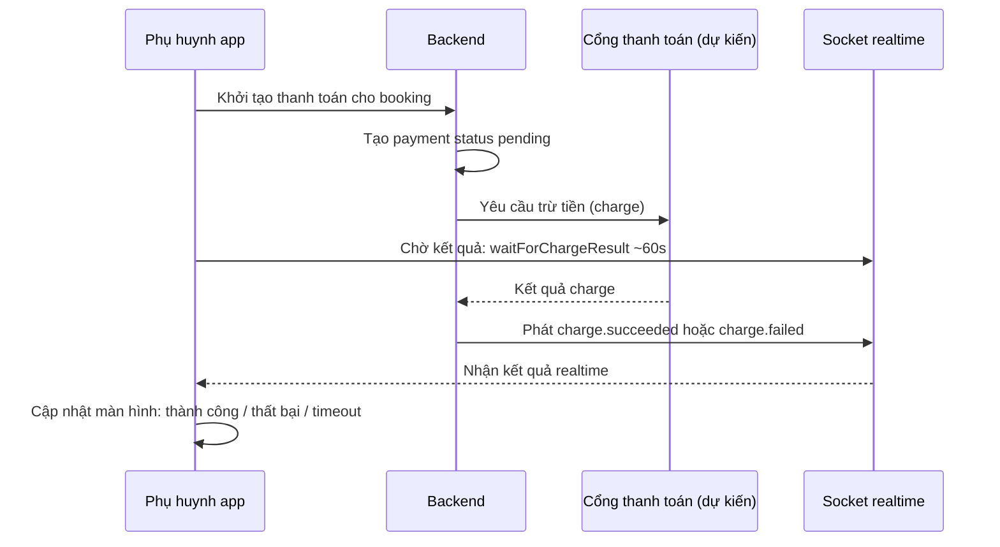
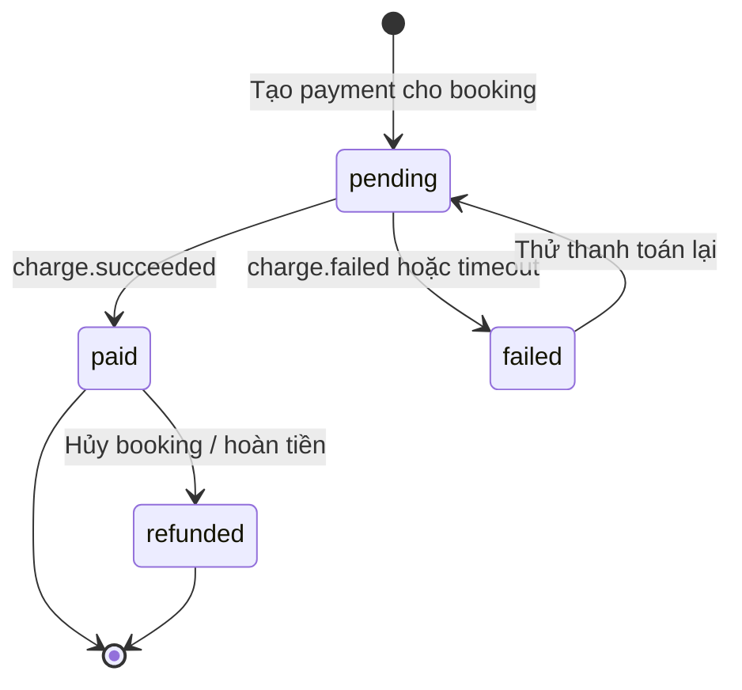
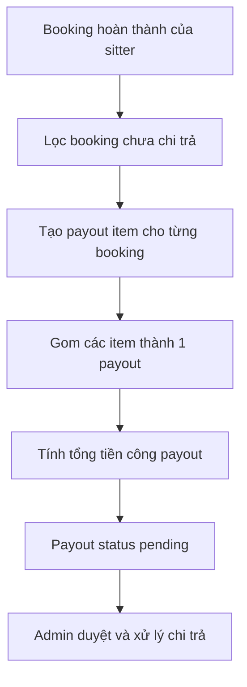
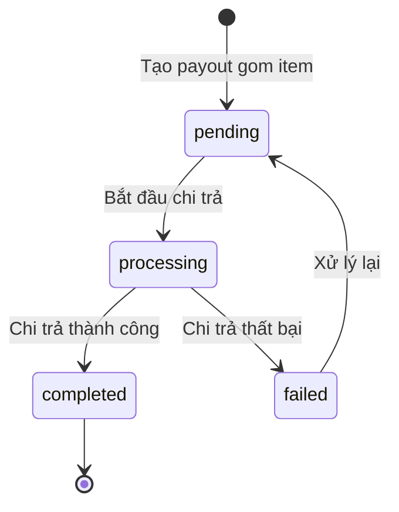

# Thanh toán & Chi trả (Payment & Payout)

> Tính năng quản lý dòng tiền của Sitter Navi: phụ huynh trả tiền cho mỗi booking đặt sitter, và nền tảng chi trả (payout) lại cho sitter sau khi hoàn thành công việc. Tài liệu này mô tả nghiệp vụ dưới góc nhìn sản phẩm — WHAT & WHY — dành cho product/business, không phải tài liệu kỹ thuật.

---

## Tổng quan

Sitter Navi là nền tảng kết nối phụ huynh với người trông trẻ (sitter) tại Nhật. Sau mỗi buổi trông trẻ (booking), có hai dòng tiền cần quản lý:

1. **Thu tiền từ phụ huynh** — mỗi booking phát sinh một khoản phải thu. Phụ huynh thanh toán, hệ thống ghi nhận trạng thái đã trả / chưa trả / thất bại / đã hoàn tiền.
2. **Chi tiền cho sitter** — nền tảng gom các booking đã hoàn thành của một sitter lại thành một đợt chi trả (payout) và trả tiền công cho họ.

Ngoài ra, bộ phận vận hành (admin) cần **đối soát billing** — xem hóa đơn (invoice) và biên lai (receipt) để kiểm tra sổ sách khớp với thực tế.

> **Điểm cần lưu ý ngay từ đầu (chi tiết ở mục Gaps):** Hiện tại hệ thống **chưa tích hợp bất kỳ cổng thanh toán bên ngoài nào** (không Stripe, không PayPay, không KOMOJU...). Toàn bộ Payment và Payout mới chỉ là **sổ ghi chép nội bộ** (internal ledger) — nghĩa là hệ thống ghi nhận "ai nợ bao nhiêu, đã trả chưa", nhưng **chưa thực sự trừ tiền / chuyển tiền tự động**. Đây là khoảng trống lớn nhất của tính năng.

---

## Actors

| Actor | Vai trò trong nghiệp vụ thanh toán |
|---|---|
| **Phụ huynh (Parent)** | Người trả tiền cho booking. Dùng app mobile để đặt và thanh toán. |
| **Sitter (Caregiver)** | Người nhận tiền công. Nhận payout sau khi hoàn thành các booking. Dùng app mobile riêng. |
| **Admin / Operator** | Vận hành nền tảng: tạo/duyệt payment & payout, đối soát billing (invoice/receipt) trên dashboard web. |
| **Hệ thống (Backend)** | Ghi nhận trạng thái payment/payout, phát tín hiệu realtime kết quả charge về app. |
| **Cổng thanh toán ngoài** | *(chưa tồn tại — dự kiến tương lai)* Bên thực sự trừ tiền thẻ / ví điện tử. |

---

## Chức năng chính

1. **Ghi nhận khoản thanh toán của phụ huynh** — mỗi booking có một bản ghi payment với số tiền và trạng thái: `pending` (chờ trả) → `paid` (đã trả) / `failed` (thất bại) / `refunded` (đã hoàn tiền).
2. **App mobile chờ kết quả charge qua realtime** — khi phụ huynh bấm thanh toán, app không chờ đồng bộ mà lắng nghe tín hiệu realtime (socket) báo kết quả trừ tiền: `charge.succeeded` hoặc `charge.failed`. App chờ tối đa ~60 giây (`waitForChargeResult`), quá thời gian thì coi như timeout.
3. **Gom booking thành đợt chi trả cho sitter** — nhiều booking đã hoàn thành của một sitter được gộp thành một payout. Mỗi booking trong đợt là một dòng chi tiết (payout item). Payout có trạng thái: `pending` → `processing` → `completed` / `failed`.
4. **Đối soát billing (admin)** — dashboard web cho phép admin xem invoice và receipt, kiểm tra sổ sách thu/chi.

---

## Luồng nghiệp vụ

### Luồng 1 — Phụ huynh thanh toán booking (app chờ kết quả charge qua realtime)

> Phụ huynh khởi tạo thanh toán trên app; app lắng nghe socket để nhận kết quả trừ tiền thay vì chờ đồng bộ. Timeout ~60 giây.

### Luồng 2 — Vòng đời trạng thái Payment (mỗi booking)

> Trạng thái khoản thu của một booking. `refunded` áp dụng khi hủy booking hoặc hoàn tiền sau khi đã trả.

### Luồng 3 — Gom booking thành payout cho sitter

> Admin gom các booking đã hoàn thành và chưa chi trả của một sitter thành một đợt payout; mỗi booking là một payout item.

### Luồng 4 — Vòng đời trạng thái Payout (mỗi sitter)

> Trạng thái một đợt chi trả cho sitter.

---

## Màn hình & điểm chạm

| Điểm chạm | Nơi | Mô tả |
|---|---|---|
| Khởi tạo thanh toán booking | App phụ huynh (mobile) | Phụ huynh bấm thanh toán cho booking; app chờ kết quả charge qua socket (~60s). |
| Thông báo kết quả charge | App phụ huynh (mobile) | App nhận `charge.succeeded` / `charge.failed` realtime rồi cập nhật màn hình. |
| Nhận tiền công | App sitter (babysitter) | Sitter nhận payout; app sitter cũng dùng socket cho kết quả charge/payment. |
| Quản lý payment | Dashboard web (admin) — khu vực quản lý booking/dự án | Admin xem và cập nhật trạng thái payment gắn với booking. |
| Quản lý payout | Dashboard web (admin) | Admin tạo/duyệt payout, xem payout item theo sitter. |
| Đối soát billing | Dashboard web (admin) — `billing-management` | Admin xem invoice và receipt để đối soát sổ sách thu/chi. |

---

## Trạng thái hiện tại & Gaps

> ⚠️ **Đây là mục quan trọng nhất về mặt sản phẩm.**

**Trạng thái hiện tại — mới là "sổ cái nội bộ", chưa có dòng tiền thật:**

- **CHƯA tích hợp cổng thanh toán ngoài nào.** Không Stripe, không PayPay, không KOMOJU, không cổng nào khác. Trong sổ sách kỹ thuật, module payment/payout được ghi rõ là *"internal ledger, no external gateway"*.
- **Payment và Payout hiện chỉ là CRUD sổ ghi chép.** Hệ thống ghi nhận số tiền và trạng thái (`pending/paid/failed/refunded` cho payment; `pending/processing/completed/failed` cho payout), nhưng bản thân hệ thống **không thực sự trừ tiền của phụ huynh, cũng không thực sự chuyển tiền cho sitter**. Việc đổi trạng thái hiện là thao tác thủ công/nghiệp vụ nội bộ, không phải kết quả từ một giao dịch tài chính thật.
- **Luồng charge thật (trừ tiền) chưa hoàn chỉnh — đây là gap lớn nhất.** Phía app đã có sẵn cơ chế chờ kết quả charge qua realtime (`waitForChargeResult`, sự kiện `charge.succeeded`/`charge.failed`, timeout ~60s), nhưng **chưa có bên nào thực sự phát ra các sự kiện charge này** vì chưa có cổng thanh toán đứng sau. Cơ chế phía client đang "chờ một tín hiệu chưa có nguồn phát".

**Dấu hiệu di sản (legacy) cần dọn dẹp / xác nhận:**

- App **sitter (babysitter)** giữ `SocketService` với `waitForChargeResult` và lắng nghe `charge.succeeded`/`charge.failed` — cơ chế realtime cho kết quả thanh toán đã dựng sẵn nhưng chưa được kích hoạt đầy đủ.
- App **phụ huynh (parents)** còn **code sót lại**: `socket_service.dart` vẫn còn method `waitForChargeResult`, và `deep_link_service.dart` còn nhánh `payment-success/failed` **đang bị comment** — là di sản chưa dùng, **cần xác nhận** có giữ hay bỏ.

**Khoảng trống nghiệp vụ cần quyết định:**

- Chọn và tích hợp cổng thanh toán thật (theo ràng buộc dự án — cần chốt danh sách cổng được phép).
- Hoàn thiện luồng charge end-to-end: từ app khởi tạo → cổng trừ tiền → backend nhận kết quả → phát socket → app cập nhật.
- Xác định cơ chế chuyển tiền thật cho payout (bank transfer / cổng payout), thay cho việc đổi trạng thái thủ công.
- Đối soát billing hiện dựa trên invoice/receipt của sổ nội bộ — cần khớp với giao dịch cổng thật khi có.

---

## Tham chiếu kỹ thuật (ngắn)

- **Dữ liệu (ERD, backend `sitternavi-web-BE`):**
  - `payment` — gắn với `booking`, có `amount` và `status` (`pending/paid/failed/refunded`).
  - `payout` — gắn với `sitter` (user), có `amount` và `status` (`pending/processing/completed/failed`).
  - `payout_item` — mỗi dòng gắn 1 `booking` vào 1 `payout` (quan hệ gom nhiều booking).
  - Ghi chú trong ERD: *"Payment / Payout (internal ledger, no external gateway)"*.
- **API (backend):** cặp CRUD chuẩn `admin/payments` + `client/payments`, và `admin/payouts` + `client/payouts` (dưới `/api/v1/`). Đều là CRUD tiêu chuẩn, chưa có endpoint charge/gateway riêng.
- **Realtime (app mobile):** `socket_service.dart` — sự kiện `charge.succeeded` / `charge.failed`, hàm `waitForChargeResult(chargeId)` timeout ~60s (`socket_io_client`, transport websocket).
- **Dashboard web (`sitternavi-web`, admin):** khu vực `billing-management` (invoice / receipt) và quản lý payment trong `project-management`.
</content>
</invoke>
