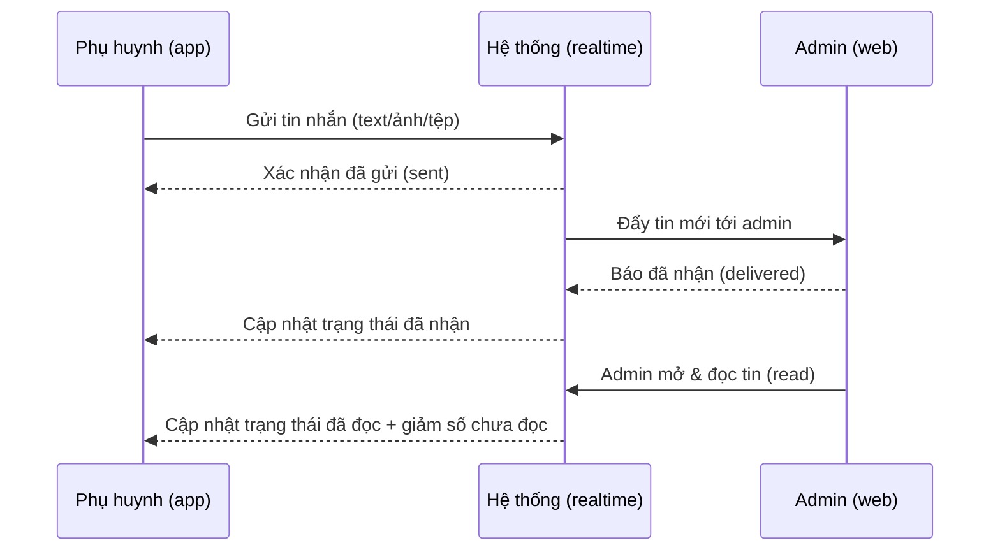
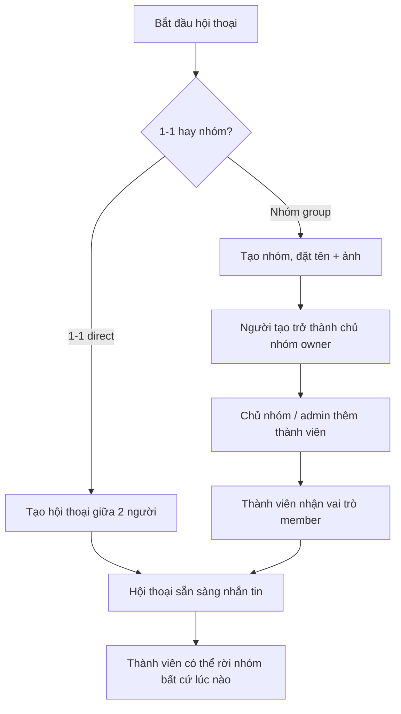
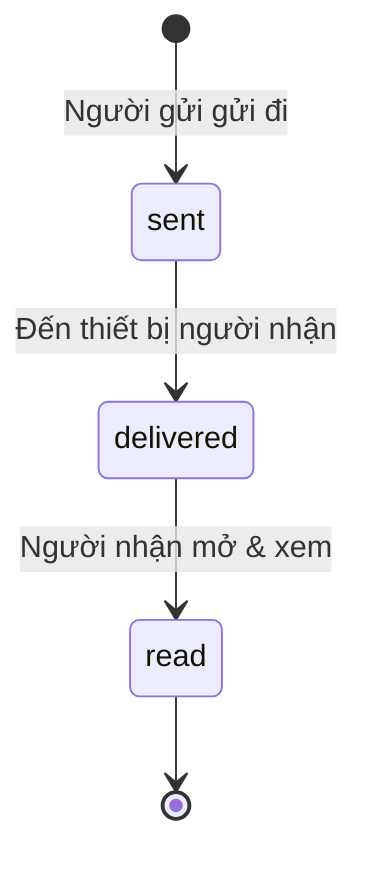

# Nhắn tin & Chat realtime

> Cách phụ huynh và đội ngũ quản trị của Sitter Navi trao đổi trực tiếp trong ứng dụng — nhắn tin 1-1 hoặc theo nhóm, gửi ảnh/tệp, biết tin đã đọc hay chưa, tất cả cập nhật tức thời.

## Tổng quan

Nhắn tin là kênh liên lạc **trong nền tảng** giữa phụ huynh và đội ngũ Sitter Navi, thay cho việc phải gọi điện hay dùng ứng dụng ngoài. Mục tiêu nghiệp vụ:

1. **Hỗ trợ nhanh, đúng ngữ cảnh** — phụ huynh có thể hỏi đáp, gửi thông tin (ảnh, tệp) ngay trong app; đội quản trị trả lời từ web.
2. **Realtime** — tin nhắn đến ngay lập tức, không cần bấm tải lại; người gửi thấy được tin đã "gửi → nhận → đọc".
3. **Nhóm hội thoại linh hoạt** — hỗ trợ cả trò chuyện 1-1 và nhóm nhiều người, có phân vai trò để quản lý thành viên.

Vì sao quan trọng: một kênh liên lạc tin cậy, có lưu vết và trạng thái đọc giúp giảm hiểu lầm, rút ngắn thời gian phản hồi và giữ mọi trao đổi tập trung một chỗ.

**Phạm vi hiện tại — điểm cần lưu ý:** tính năng chat có mặt trên **web quản trị** và **app phụ huynh**. **App babysitter (sitter) hiện KHÔNG có tính năng chat** — sitter chưa thể nhắn tin trong nền tảng (chi tiết ở mục "Trạng thái hiện tại & Gaps").

## Actors

| Actor | Điểm truy cập | Vai trò trong luồng này |
|---|---|---|
| **Phụ huynh** | App phụ huynh (Flutter) | Xem danh sách hội thoại, gửi/nhận tin nhắn text/ảnh/tệp realtime, thấy số tin chưa đọc và trạng thái đọc |
| **Admin / Operator** | Web quản trị (Next.js) | Trao đổi với phụ huynh, quản lý hội thoại nhóm (tạo nhóm, thêm/xóa thành viên) |
| **Hệ thống (Backend)** | — | Lưu tin nhắn, đếm chưa đọc, cập nhật trạng thái gửi/nhận/đọc, và đẩy realtime tới các bên qua kết nối thời gian thực |
| **Babysitter / Sitter** | App babysitter (Flutter) | **KHÔNG tham gia chat.** App sitter không có màn hình nhắn tin; kết nối realtime của app này chỉ dùng cho kết quả thanh toán, không phải chat |

## Chức năng chính

| # | Chức năng | Mô tả ngắn (ngôn ngữ nghiệp vụ) | Ai dùng |
|---|---|---|---|
| 1 | **Hội thoại 1-1** | Trò chuyện riêng giữa hai người (kiểu `direct`) | Phụ huynh, Admin |
| 2 | **Hội thoại nhóm** | Nhóm nhiều thành viên (kiểu `group`), có tên và ảnh nhóm | Admin, Phụ huynh |
| 3 | **Phân loại hội thoại** | Nhóm nội bộ đội ngũ (`internal`) hoặc phòng trao đổi với phụ huynh (`parent_room`) | Admin |
| 4 | **Vai trò thành viên** | Mỗi thành viên là chủ nhóm (owner), quản trị (admin) hoặc thành viên (member) — quyết định ai được thêm/xóa người, sửa nhóm | Admin |
| 5 | **Gửi tin nhắn** | Gửi văn bản, ảnh, hoặc tệp đính kèm; có cả tin hệ thống (thông báo tự động) | Phụ huynh, Admin |
| 6 | **Đính kèm ảnh/tệp** | Tải ảnh/tệp lên rồi gắn vào tin nhắn (kèm tên, dung lượng, loại tệp) | Phụ huynh, Admin |
| 7 | **Đếm tin chưa đọc** | Hiển thị số tin chưa đọc theo từng hội thoại và tổng cộng (badge) | Phụ huynh, Admin |
| 8 | **Trạng thái tin nhắn** | Cho biết tin đã "gửi → đã nhận → đã đọc" | Phụ huynh, Admin |
| 9 | **Cập nhật realtime** | Tin nhắn, số chưa đọc và trạng thái đọc cập nhật tức thời qua kết nối thời gian thực | Phụ huynh, Admin |

**Ba vai trò thành viên trong một hội thoại:**

| Vai trò | Quyền chính |
|---|---|
| `owner` (chủ nhóm) | Toàn quyền: sửa nhóm, thêm/xóa thành viên, giải tán nhóm |
| `admin` (quản trị) | Sửa nhóm, thêm/xóa thành viên |
| `member` (thành viên) | Gửi/nhận tin, xem thành viên, rời nhóm |

**Bốn loại nội dung tin nhắn:** `text` (văn bản) · `image` (ảnh) · `file` (tệp) · `system` (tin hệ thống, tự sinh — ví dụ thông báo có người tham gia/rời nhóm).

## Luồng nghiệp vụ

### 1. Gửi tin nhắn realtime giữa phụ huynh và admin (qua hệ thống)

Phụ huynh gửi một tin; hệ thống lưu lại và đẩy ngay tới admin đang trực tuyến, đồng thời phản hồi trạng thái đã nhận/đã đọc về cho phụ huynh.

*Caption: Một tin nhắn đi qua hệ thống và quay lại người gửi kèm trạng thái, tất cả trong thời gian thực.*

### 2. Tạo và tham gia hội thoại

Cách một hội thoại 1-1 hoặc nhóm được khởi tạo và cách thành viên được đưa vào.

*Caption: Từ lúc mở hội thoại tới lúc sẵn sàng trao đổi, kèm phân vai trò thành viên.*

### 3. Vòng đời trạng thái của một tin nhắn

Mỗi tin nhắn đi qua ba trạng thái, theo dõi riêng cho từng người nhận.

*Caption: Trạng thái tin nhắn — gửi, đã nhận, đã đọc.*

## Màn hình & điểm chạm

| Điểm chạm | Nơi | Mô tả |
|---|---|---|
| **Danh sách hội thoại** | App phụ huynh, Web admin | Liệt kê các hội thoại của người dùng, kèm tin nhắn cuối và số chưa đọc |
| **Màn hình chat** | App phụ huynh (chat), Web admin (`/chat-room`) | Xem lịch sử tin nhắn, gửi text/ảnh/tệp, thấy trạng thái đọc realtime |
| **Tạo / quản lý nhóm** | Web admin (`/chat-room` + tạo phòng) | Tạo nhóm, đặt tên/ảnh, thêm/xóa thành viên, phân vai trò |
| **Badge chưa đọc** | App phụ huynh, Web admin | Chấm/đếm số tin chưa đọc; trên app còn cập nhật badge ứng dụng qua thông báo đẩy |
| **App babysitter** | — | **Không có màn hình chat** (xem Gaps) |

## Trạng thái hiện tại & Gaps

- **App babysitter KHÔNG có chat.** App sitter không có màn hình nhắn tin. Kết nối realtime của app này chỉ lắng nghe **kết quả thanh toán** (`charge.succeeded` / `charge.failed`), không phải chat. Nếu nghiệp vụ cần sitter trao đổi trực tiếp với phụ huynh/admin, đây là hạng mục **cần bổ sung** (xây màn hình chat + đấu nối realtime cho app sitter). **(cần xác nhận với nghiệp vụ về nhu cầu)**
- **Chat = web admin + app phụ huynh.** Trục trao đổi hiện tại là phụ huynh ↔ admin. Kịch bản 1-1 phụ huynh ↔ sitter chưa khả thi vì phía sitter thiếu giao diện.
- **Đầu vào tạo hội thoại** — API hiện có tạo nhóm (`group`); cách khởi tạo hội thoại 1-1 (`direct`) và luồng UI cụ thể để phụ huynh mở hội thoại mới **(cần xác nhận)**.
- **Loại `kind` (`internal` vs `parent_room`)** phân biệt nhóm nội bộ đội ngũ và phòng trao đổi với phụ huynh; quy tắc nghiệp vụ chi tiết khi nào dùng loại nào **(cần xác nhận)**.
- **Tin hệ thống (`system`)** tồn tại như một loại tin; danh sách sự kiện nào tự sinh tin hệ thống **(cần xác nhận)**.

## Tham chiếu kỹ thuật (ngắn)

> Phần này dành cho người kỹ thuật; nghiệp vụ có thể bỏ qua.

- **Backend:** module chat nằm ở schema PostgreSQL riêng `conversation`, với các bảng: `conversation` (type `direct`/`group`, kind `internal`/`parent_room`, owner, tin nhắn cuối), `participant` (vai trò `owner`/`admin`/`member` + `unreadCount`), `message` (loại `text`/`image`/`file`/`system`), `message_attachment` (tệp đính kèm), `message_status` (trạng thái `sent`/`delivered`/`read` theo từng người nhận).
- **REST API** (`/api/v1/conversations`, cần đăng nhập JWT): tạo nhóm · liệt kê hội thoại của tôi · tổng chưa đọc (`/unread-count`) · chi tiết nhóm · thêm/xóa thành viên · rời nhóm · lịch sử tin nhắn · gửi tin nhắn · lấy URL tải tệp lên (`/upload-url`). Quyền theo route qua `ParticipantGuard` / `GroupRoleGuard`.
- **Realtime:** chat thời gian thực chạy qua **WebSocket gateway** (`conversation.gateway.ts`) — không phải REST. Client kết nối tới namespace `conversations` với token, nhận các sự kiện như tin mới, đã gửi/đã nhận/đã đọc, tổng chưa đọc, cập nhật danh sách hội thoại.
- **App phụ huynh (Flutter):** `SocketService` (socket_io_client) kết nối `conversations`, phát sự kiện qua stream (`onNewMessage`, `onMessageSent/Read/Delivered`, `onTotalUnread`...); badge cập nhật từ `unreadCount` trong thông báo đẩy.
- **Web admin (Next.js):** route `/chat-room` (+ `[id]`), socket.io-client (`src/services/socket/`), service `conversations.service.ts`.
- **App babysitter (Flutter):** có `SocketService` nhưng **chỉ cho kết quả thanh toán** (`charge.succeeded`/`charge.failed`) — không có tính năng chat.

> Nguồn: `backend/sitternavi-web-BE/overview/api-catalog.md` · `erd.md`; `mobile/sitternavi-app-parents/overview/patterns.md`; `mobile/sitternavi-app-babysitter/overview/patterns.md`; `frontend/sitternavi-web/overview/structure.md`.
