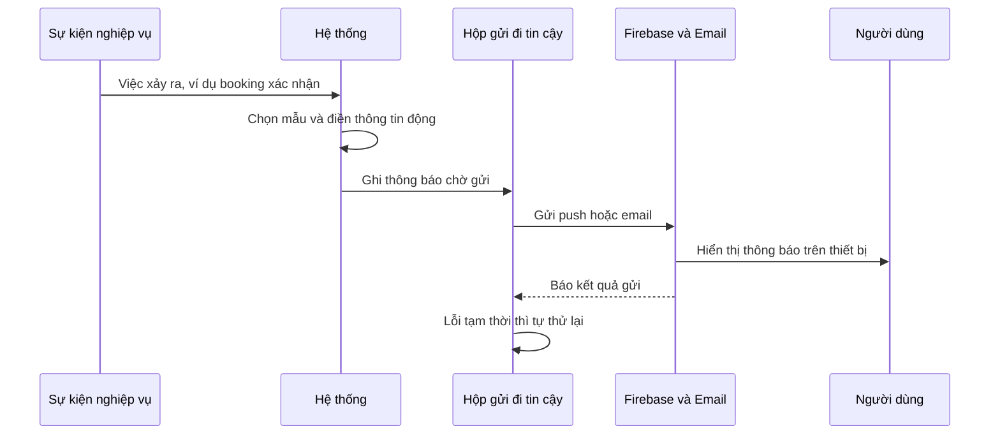
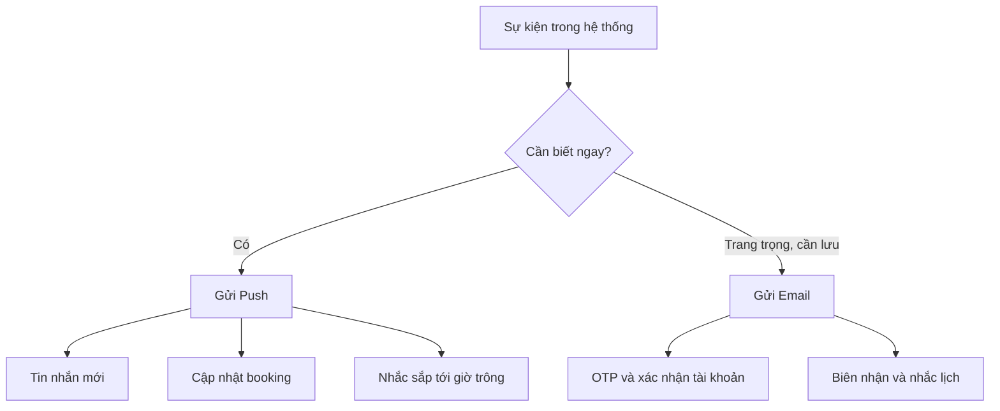
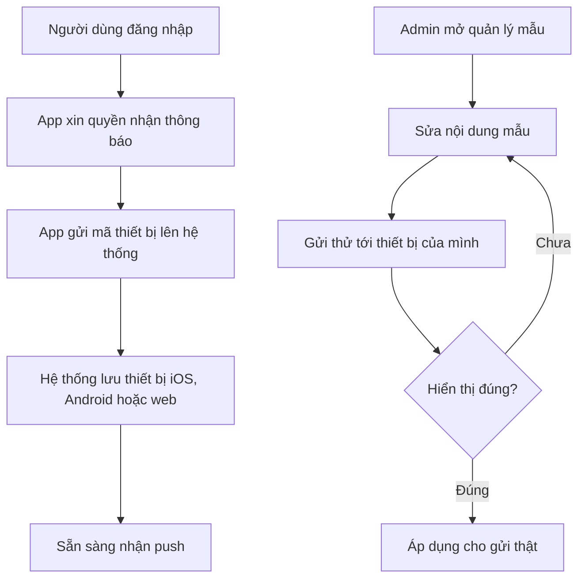

# Thông báo (Push & Email)

> Cách Sitter Navi chủ động nhắc và cập nhật cho phụ huynh, babysitter và admin qua thông báo đẩy (push) trên điện thoại/web và email — dựa trên mẫu (template) soạn sẵn và cơ chế gửi tin cậy tự động thử lại.

## Tổng quan

Thông báo là kênh **hệ thống chủ động tìm đến người dùng** — thay vì chờ người dùng mở app kiểm tra. Sitter Navi dùng hai kênh:

- **Thông báo đẩy (Push)** — hiện lên trên điện thoại (iOS/Android) hoặc trình duyệt (web) ngay cả khi người dùng không mở app. Dùng cho những việc cần biết ngay: có tin nhắn mới, booking được xác nhận, sắp tới giờ trông trẻ.
- **Email** — dùng cho nội dung trang trọng, cần lưu lại hoặc dài hơn: xác nhận đăng ký, mã OTP, biên nhận, nhắc lịch.

Ba đặc điểm nghiệp vụ quan trọng:

1. **Gửi theo mẫu (template)** — mỗi loại thông báo có một mẫu soạn sẵn (tiêu đề + nội dung, có chỗ điền thông tin động như tên con, giờ hẹn). Admin quản lý mẫu ở web quản trị, nên đổi nội dung/wording **không cần lập trình lại**.
2. **Gửi theo sự kiện** — thông báo phát ra tự động khi có việc xảy ra trong hệ thống (ví dụ: booking chuyển sang "đã xác nhận" → tự gửi thông báo cho phụ huynh và sitter).
3. **Gửi tin cậy, tự thử lại** — mỗi thông báo được ghi vào một "hộp gửi đi" (outbox) trước khi gửi; nếu lần gửi đầu thất bại (mạng lỗi, dịch vụ bận), hệ thống tự thử lại. Nhờ vậy thông báo không bị mất âm thầm.

Vì sao quan trọng: thông báo đúng lúc là thứ giữ phụ huynh và sitter phối hợp trơn tru (không lỡ lịch, không bỏ sót tin nhắn) mà không cần nhân viên nhắc thủ công. Đây cũng là kênh gửi OTP và các email giao dịch thiết yếu.

## Actors

| Actor | Điểm truy cập | Vai trò trong luồng này |
|---|---|---|
| **Phụ huynh** | App phụ huynh | Nhận push + email (tin nhắn mới, cập nhật booking, nhắc lịch, OTP…); cấp quyền nhận thông báo; thiết bị được đăng ký sau khi đăng nhập |
| **Babysitter / Sitter** | App babysitter | Nhận push + email (việc mới, thay đổi lịch, tin nhắn…); tương tự phụ huynh |
| **Admin / Operator** | Web quản trị | Quản lý mẫu push & email; gửi thử để kiểm tra trước khi dùng thật |
| **Hệ thống (Backend)** | — | Bắt sự kiện nghiệp vụ, soạn nội dung từ mẫu, gửi qua Firebase (push) / SES-SMTP (email), theo dõi outbox và tự thử lại |

## Chức năng chính

| # | Chức năng | Mô tả ngắn (ngôn ngữ nghiệp vụ) | Ai dùng |
|---|---|---|---|
| 1 | **Thông báo đẩy theo sự kiện** | Tự gửi push tới thiết bị người dùng khi có việc xảy ra (tin nhắn mới, cập nhật booking, nhắc lịch…) | Phụ huynh, Sitter |
| 2 | **Email theo sự kiện** | Tự gửi email cho các nội dung giao dịch/thông báo (OTP, xác nhận, nhắc lịch…) | Phụ huynh, Sitter, Admin |
| 3 | **Đăng ký thiết bị nhận push** | Sau khi đăng nhập, app ghi nhận thiết bị (iOS/Android/web) để nhận được push; gỡ khi đăng xuất | Phụ huynh, Sitter |
| 4 | **Quản lý mẫu thông báo** | Admin tạo/sửa nội dung mẫu push & email (tiêu đề, nội dung, ảnh) mà không cần lập trình | Admin |
| 5 | **Gửi thử (test)** | Admin gửi thử một mẫu (hoặc nội dung tự do) để kiểm tra trước khi áp dụng thật | Admin |
| 6 | **Gửi tin cậy & tự thử lại** | Mỗi thông báo được xếp vào hộp gửi đi; lỗi tạm thời sẽ được thử lại tự động, tránh mất thông báo | Hệ thống |

**Kênh và loại nội dung (định hướng nghiệp vụ):**

| Kênh | Phù hợp cho | Ví dụ |
|---|---|---|
| **Push** | Việc cần biết ngay, ngắn gọn | Tin nhắn mới, booking xác nhận/hủy, nhắc sắp tới giờ trông |
| **Email** | Nội dung trang trọng, cần lưu, dài hơn | OTP đăng nhập/xác minh, xác nhận đăng ký, biên nhận, nhắc lịch |

> Danh sách sự kiện cụ thể nào gắn với mẫu nào được cấu hình trong "sổ đăng ký sự kiện" của hệ thống; nội dung mẫu do admin biên soạn. Bộ sự kiện/mẫu đang bật cụ thể tại thời điểm hiện tại **(cần xác nhận)**.

## Luồng nghiệp vụ

### 1. Từ sự kiện nghiệp vụ tới thông báo tới tay người dùng

Khi một việc xảy ra trong hệ thống (ví dụ booking được xác nhận), hệ thống soạn nội dung từ mẫu và gửi đi qua hộp gửi đi tin cậy, rồi push/email đến người dùng.

*Điểm mấu chốt: thông báo luôn đi qua "hộp gửi đi" trước khi phát, nên nếu lần gửi đầu thất bại hệ thống vẫn tự thử lại — thông báo không mất âm thầm.*

### 2. Các loại thông báo và kênh gửi

Cùng một sự kiện có thể chọn kênh phù hợp; việc cần biết ngay ưu tiên push, nội dung trang trọng ưu tiên email.

*Push và email bổ sung cho nhau: push để phản ứng nhanh, email để lưu vết và cho nội dung dài. Một sự kiện quan trọng có thể dùng cả hai.*

### 3. Đăng ký thiết bị và gửi thử của admin

Người dùng phải có thiết bị được đăng ký thì mới nhận push; admin có thể gửi thử một mẫu để kiểm tra trước khi dùng thật.

*Đăng ký thiết bị diễn ra ngầm ngay sau đăng nhập; khi đăng xuất thiết bị được gỡ để không gửi nhầm. Chức năng gửi thử giúp admin duyệt nội dung trước khi người dùng thật nhận được.*

## Màn hình & điểm chạm

**App phụ huynh & App babysitter** (Flutter):

| Điểm chạm | Vai trò |
|---|---|
| Xin quyền thông báo | App hỏi quyền nhận push ngay khi khởi động / sau đăng nhập |
| Đăng ký thiết bị | Ngầm gửi mã thiết bị lên hệ thống sau khi đăng nhập; gỡ khi đăng xuất |
| Push khi app đang mở / nền / tắt | Hiển thị thông báo; cập nhật "chấm đỏ" số chưa đọc trên icon app |
| Chạm vào thông báo | Mở đúng màn hình liên quan (ví dụ: mở hội thoại khi có tin nhắn mới) |
| Hộp thư email | Nhận OTP, xác nhận, nhắc lịch… ngoài app |

**Web quản trị** (quản lý nội dung thông báo):

| Màn hình | Vai trò |
|---|---|
| Danh sách & chi tiết mẫu Push | Xem, tạo, sửa, xóa mẫu push (tiêu đề, nội dung, ảnh) |
| Danh sách & chi tiết mẫu Email | Xem, tạo, sửa, xóa mẫu email (tiêu đề, nội dung) |
| Gửi thử | Gửi thử một mẫu hoặc nội dung tự do để kiểm tra hiển thị |

> Điểm chạm ngoài màn hình: **thiết bị của người dùng** (nhận push qua Firebase) và **hộp thư email** (nhận email giao dịch/thông báo).

## Trạng thái hiện tại & Gaps

- **Đã có & hoạt động:** hai kênh push (Firebase) và email; gửi theo sự kiện dựa trên mẫu; hộp gửi đi (outbox) có tự thử lại; đăng ký/gỡ thiết bị theo phiên đăng nhập; admin quản lý mẫu và gửi thử; cập nhật "chấm đỏ" số chưa đọc trên app.
- **Bộ sự kiện đang bật** — hệ thống có "sổ đăng ký" ánh xạ sự kiện → mẫu, nhưng danh sách sự kiện/mẫu thực tế đang bật tại thời điểm này chưa liệt kê trong tài liệu **(cần xác nhận)**.
- **Tùy chọn tắt/bật thông báo theo người dùng** — chưa rõ người dùng có màn hình cài đặt để tự chọn nhận loại thông báo nào; hiện mới thấy cơ chế xin quyền ở cấp hệ điều hành **(cần xác nhận)**.
- **Ngưỡng thử lại** — thông báo lỗi tạm thời được thử lại tự động (giới hạn số lần); chi tiết chính sách retry là phần kỹ thuật, giữ ở mức "hệ thống tự lo".

## Tham chiếu kỹ thuật (ngắn)

**Endpoint chính** (chi tiết: [api-catalog](../backend/sitternavi-web-BE/overview/api-catalog.md), mục `push-notification` và `email`):

- `POST /api/v1/client/devices` · `DELETE /api/v1/client/devices/:token` — đăng ký / gỡ thiết bị nhận push (sau đăng nhập / khi đăng xuất).
- `GET|POST|PATCH|DELETE /api/v1/admin/push-templates` — quản lý mẫu push (admin).
- `GET|POST|PATCH|DELETE /api/v1/admin/email-templates` — quản lý mẫu email (admin).
- `POST /api/v1/admin/push-notifications/test` · `.../test/raw` — gửi thử theo mẫu / gửi thử nội dung tự do (admin).

**Thực thể dữ liệu chính** (chi tiết: [erd](../backend/sitternavi-web-BE/overview/erd.md), mục "10. Messaging — Email / Push"):

- `email_template` / `push_template` — mẫu nội dung (tiêu đề, nội dung, loại); push có thêm ảnh và dữ liệu kèm.
- `outbox_email` / `outbox_push` — "hộp gửi đi": lưu từng thông báo chờ gửi, trạng thái, số lần thử, lỗi gần nhất — nền tảng cho gửi tin cậy & tự thử lại.
- `user_device` — thiết bị đã đăng ký của người dùng, phân loại `platform` = `ios` / `android` / `web`.

**Cơ chế nền (tóm tắt):** thông báo phát theo sự kiện, soạn từ mẫu, đi qua outbox rồi gửi bằng **Firebase FCM** (push) và **AWS SES / SMTP** (email); một tiến trình chạy định kỳ sẽ gửi lại các thông báo còn kẹt. Kiến trúc chi tiết (5 lớp messaging + outbox + sổ đăng ký sự kiện): [patterns](../backend/sitternavi-web-BE/overview/patterns.md), mục "5. Messaging". Phía app, dịch vụ FCM và đăng ký mã thiết bị: [patterns app phụ huynh](../mobile/sitternavi-app-parents/overview/patterns.md) / [patterns app babysitter](../mobile/sitternavi-app-babysitter/overview/patterns.md).
