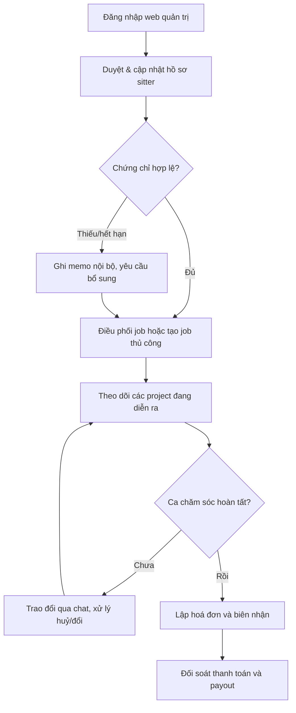
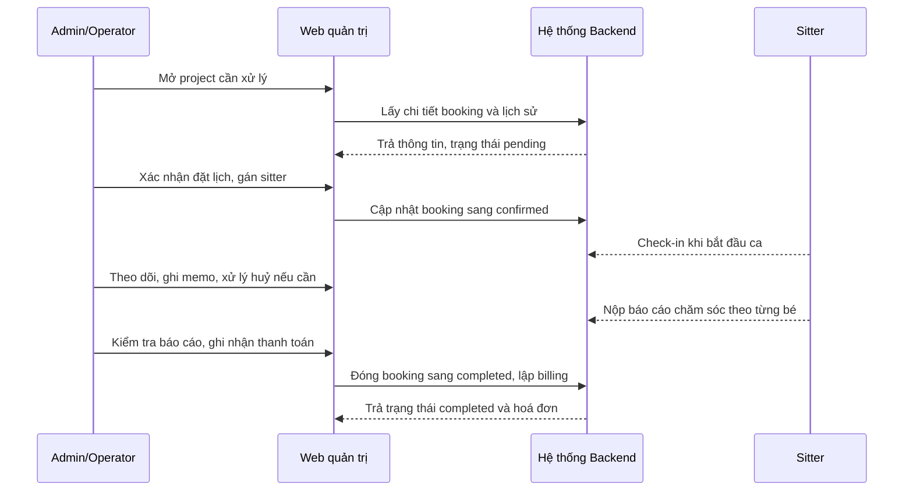
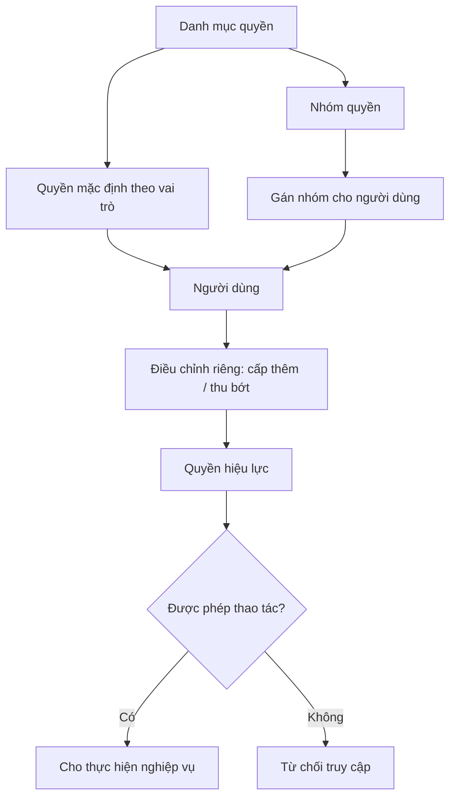

# Vận hành Back-office (Web quản trị)

> Bộ công cụ để đội vận hành Sitter Navi quản lý sitter, điều phối công việc, theo dõi từng ca chăm sóc, đối soát tiền và trao đổi với phụ huynh — tất cả trên một dashboard web duy nhất, kèm dữ liệu nền dùng chung cho toàn hệ thống.

## Tổng quan

Sitter Navi là nền tảng kết nối **phụ huynh** với **người trông trẻ (babysitter/sitter)** tại Nhật. Ngoài hai app di động (app phụ huynh, app babysitter), hệ thống có một **Web quản trị** (Next.js) chỉ dành cho **ADMIN/OPERATOR** — không dành cho phụ huynh hay sitter.

Web quản trị là "phòng điều hành" của dịch vụ. Mọi việc mà con người phải làm để dịch vụ chạy trơn tru đều diễn ra ở đây:

1. **Chuẩn hoá nguồn cung sitter** — duyệt và cập nhật hồ sơ sitter, kiểm tra chứng chỉ, xem lịch rảnh, ghi chú nội bộ, và chủ động mời sitter tham gia.
2. **Điều phối công việc** — quản lý danh sách "job" (công việc) và tạo job thủ công khi cần khớp cung–cầu ngoài luồng tự động.
3. **Theo dõi từng ca chăm sóc (project/booking)** — từ lúc đặt lịch, thanh toán, huỷ, ghi chú, xem lịch sử thay đổi, đến báo cáo chăm sóc cho từng bé.
4. **Đối soát tiền** — lập hoá đơn (invoice) và biên nhận (receipt); theo dõi thanh toán của phụ huynh và khoản chi trả (payout) cho sitter.
5. **Giao tiếp** — phòng chat để trao đổi với phụ huynh hoặc nội bộ đội vận hành.
6. **Quản trị nội bộ** — phân quyền cho từng nhân viên vận hành (nhóm quyền/vai trò).
7. **Nuôi dữ liệu nền** — địa chỉ Nhật (tỉnh/thành → quận huyện → mã bưu chính), FAQ, và danh mục/sản phẩm.

Vì sao quan trọng: chất lượng dịch vụ trông trẻ phụ thuộc trực tiếp vào việc vận hành có kiểm soát — sitter đủ chuẩn, ca chăm sóc được theo dõi sát, tiền bạc minh bạch. Web quản trị biến các thao tác thủ công rời rạc thành một quy trình tập trung, có phân quyền và có dấu vết.

> Màn hình mặc định sau khi đăng nhập là **Quản lý project** (`/project-management`) — phản ánh việc theo dõi ca chăm sóc là công việc trung tâm hằng ngày của đội vận hành.

## Actors

| Actor | Điểm truy cập | Vai trò trong luồng này |
|---|---|---|
| **Admin** | Web quản trị | Toàn quyền vận hành; quản trị phân quyền, dữ liệu nền, và mọi nghiệp vụ bên dưới |
| **Operator (nhân viên vận hành)** | Web quản trị | Thực hiện nghiệp vụ trong phạm vi quyền được cấp qua nhóm quyền/vai trò |
| **Hệ thống (Backend)** | — | Cấp API admin, thực thi kiểm tra quyền, lưu trạng thái booking/thanh toán, phát realtime chat |
| **Sitter** *(đối tượng bị quản lý)* | App babysitter | Không dùng web quản trị; là đối tượng được duyệt hồ sơ, mời tham gia, nhận job và payout |
| **Phụ huynh** *(đối tượng bị quản lý)* | App phụ huynh | Không dùng web quản trị; là đối tượng đặt lịch, được lập hoá đơn và trao đổi qua chat |

## Chức năng chính

| # | Chức năng | Mô tả ngắn (ngôn ngữ nghiệp vụ) | Ai dùng |
|---|---|---|---|
| 1 | **Quản lý sitter** | Xem/sửa hồ sơ sitter, xem lịch rảnh, kiểm tra chứng chỉ, ghi memo nội bộ, mời sitter mới | Admin, Operator |
| 2 | **Quản lý job** | Xem danh sách công việc và **tạo job thủ công** khi cần khớp cung–cầu ngoài luồng tự động | Admin, Operator |
| 3 | **Quản lý project/booking** | Theo dõi ca chăm sóc: đặt lịch, thanh toán, huỷ, ghi chú, lịch sử thay đổi, báo cáo chăm sóc theo từng bé | Admin, Operator |
| 4 | **Billing** | Lập & quản lý hoá đơn (invoice) và biên nhận (receipt) | Admin, Operator |
| 5 | **Chat vận hành** | Phòng chat realtime với phụ huynh hoặc nội bộ | Admin, Operator |
| 6 | **Phân quyền admin** | Tạo nhóm quyền, gán quyền cho vai trò, cấp/thu quyền theo từng người | Admin |
| 7 | **Dữ liệu nền** | Quản lý địa chỉ Nhật, FAQ, danh mục/sản phẩm dùng chung toàn hệ thống | Admin, Operator |

**Vòng đời trạng thái then chốt** (đội vận hành theo dõi trên project/booking):

| Đối tượng | Các trạng thái | Ý nghĩa nghiệp vụ |
|---|---|---|
| Booking (ca chăm sóc) | `pending` → `confirmed` → `in_progress` → `completed` / `cancelled` | Chờ xác nhận → đã xác nhận → đang diễn ra → hoàn tất hoặc huỷ |
| Payment (thu của phụ huynh) | `pending` / `paid` / `failed` / `refunded` | Chờ / đã thu / thất bại / hoàn tiền |
| Payout (chi cho sitter) | `pending` / `processing` / `completed` / `failed` | Chờ / đang xử lý / đã chi / thất bại |

> Thanh toán & chi trả là **sổ nội bộ (internal ledger)** — không tích hợp cổng thanh toán ngoài. Đối soát ở đây mang tính ghi nhận trạng thái, không phải giao dịch qua gateway.

## Luồng nghiệp vụ

### 1. Một ngày vận hành điển hình

Đội vận hành đi từ củng cố nguồn cung (sitter), sang điều phối công việc, theo dõi ca chăm sóc đang diễn ra, và khép lại bằng đối soát tiền.

*Quy trình lặp trong ngày: nguồn cung sạch (sitter đủ chuẩn) là điều kiện để điều phối job; job dẫn tới project cần theo dõi; project hoàn tất mới sang khâu billing và đối soát tiền.*

### 2. Vận hành một project từ đặt lịch tới hoàn tất

Đội vận hành đồng hành cùng một ca chăm sóc qua toàn bộ vòng đời: xác nhận đặt lịch, ghi nhận thanh toán, theo dõi khi đang diễn ra, thu báo cáo chăm sóc, rồi khép sổ.

*Mỗi bước chuyển trạng thái đều để lại dấu vết (lịch sử thay đổi, memo); báo cáo chăm sóc theo từng bé là căn cứ để phụ huynh yên tâm và để đội vận hành khép sổ.*

### 3. Mô hình phân quyền admin

Quyền được lắp ghép từ ba nguồn: quyền mặc định của **vai trò**, các **nhóm quyền** gán cho người dùng, và các **điều chỉnh riêng** (cấp thêm/thu bớt) cho từng người — tổng hợp lại thành "quyền hiệu lực".

*Nhờ tách "vai trò mặc định + nhóm quyền + điều chỉnh riêng", đội vận hành có thể cấp quyền linh hoạt cho từng nhân viên mà không phải tạo vai trò mới cho mỗi ngoại lệ.*

## Màn hình & điểm chạm

**Web quản trị** — khu vực đã đăng nhập (`(dashboard)`, có Sidebar + Header). Các module **đã dựng màn**:

| Màn hình / route | Vai trò |
|---|---|
| Quản lý project (`/project-management`, `[id]`, edit, `children/[childId]/care-report`) | Danh sách & chi tiết ca chăm sóc: reservation, payment, huỷ, changelog, memo, báo cáo chăm sóc theo từng bé |
| Quản lý sitter (`/sitters-management`, `[id]`) | Hồ sơ (basic-info), lịch (calendar), chứng chỉ (qualification), memo nội bộ (internal-memo), mời sitter (invite-sitter) |
| Quản lý job (`/jobs-management`, `[id]/edit`) | Danh sách job + tạo job thủ công (manual-job) |
| Billing (`/billing-management`, `[id]`, `receipts/[id]`) | Hoá đơn (invoice) & biên nhận (receipt) |
| Chat vận hành (`/chat-room`, `[id]`) | Danh sách phòng, tạo phòng, nhắn tin realtime |

**Khu vực chưa đăng nhập** (`(auth)`): đăng nhập admin, quên/đặt lại mật khẩu — mô tả chi tiết ở tài liệu [Đăng nhập & Onboarding](./01-auth-onboarding.md).

**Dữ liệu nền** (chủ yếu là API/master data, chưa hẳn có màn quản trị riêng trên dashboard **(cần xác nhận)**): địa chỉ Nhật (prefecture/municipality/postal-code, chỉ đọc), FAQ (category/sub-category/item), danh mục & sản phẩm (category/product).

> Điểm chạm ngoài màn hình: **chat realtime** (WebSocket) với phụ huynh/nội bộ, và **email/thông báo đẩy** phát ra từ backend theo mẫu (email/push template) khi có sự kiện.

## Trạng thái hiện tại & Gaps

- **Đã có & hoạt động:** quản lý sitter (hồ sơ, lịch, chứng chỉ, memo nội bộ, mời sitter), quản lý job + tạo job thủ công, quản lý project/booking (reservation, payment, huỷ, changelog, memo, care report theo con), billing (invoice/receipt), chat-room realtime, phân quyền admin, và các API dữ liệu nền (địa chỉ Nhật, FAQ, category/product).

- **Route đã khai báo nhưng CHƯA có màn** (reserved trong `route.ts` để hiện menu, nhưng chưa có trang): **chấm công** (`/attendance`), **đặt chỗ/reservations** (`/reservations`), **sổ liên lạc** (`/contact-book`), **bảng lương/payroll** (`/payroll`), **thông báo** (`/notifications`), và **đăng ký/sign-up** (`/sign-up`). Đây là các nghiệp vụ đã lên kế hoạch nhưng chưa triển khai UI.

- **Hai điểm hở bảo mật ở cổng admin** (rủi ro cần khắc phục): API **hồ sơ phụ huynh của admin** (`admin/parent-profiles`) và API **phân quyền** (`admin/permissions`) hiện có `@Auth(ADMIN)` **bị comment** → đang **không được bảo vệ**, ai gọi cũng truy cập được. Đặc biệt nghiêm trọng với `admin/permissions` vì đây là nơi thay đổi quyền toàn hệ thống **(cần xác nhận — có thể là cấu hình tạm thời)**.

- **Điểm hở phụ thêm:** `client/postal-codes` đang public do `@Auth()` bị comment (dữ liệu địa chỉ ít nhạy cảm, nhưng vẫn nên rà) **(cần xác nhận)**. Cơ chế **API key** (`admin/api-keys`) đã có để cấp/thu key nhưng guard chưa gắn vào controller nào → chưa dùng để bảo vệ endpoint thực tế **(cần xác nhận)**.

- **Ánh xạ khái niệm FE ↔ backend:** một số khái niệm trên màn (job, changelog, memo nội bộ của sitter, care-report theo bé, tài liệu invoice/receipt) chưa ánh xạ 1–1 rõ ràng tới thực thể/endpoint backend đã ghi nhận — cần xác nhận cách backend lưu và phục vụ các dữ liệu này **(cần xác nhận)**.

## Tham chiếu kỹ thuật (ngắn)

**Nhóm endpoint admin chính** (chi tiết: [api-catalog](../backend/sitternavi-web-BE/overview/api-catalog.md)):

- **Sitter:** `admin/sitter-profiles`, `admin/sitter-availabilities`, `admin/sitter-certifications`, `admin/sitter-services` (crud 5-route).
- **Booking/project & liên quan:** `admin/bookings`, `admin/attendance-logs`, `admin/payments`, `admin/payouts`, `admin/reviews`, `admin/children`.
- **Phân quyền:** `admin/permissions` (+ `/groups`, `/roles/:role`, `/users/:userId/effective`, grant/revoke) — **⚠️ hiện auth bị comment → chưa bảo vệ**.
- **Hồ sơ phụ huynh:** `admin/parent-profiles` — **⚠️ hiện auth bị comment → chưa bảo vệ**.
- **Dữ liệu nền:** `admin/prefectures`, `admin/municipalities`, `admin/postal-codes` (chỉ đọc); `admin/faq-categories` / `admin/faq-sub-categories` / `admin/faq-items` (đủ 7 route); `admin/categories` (chỉ đọc), `admin/products` (đủ 7 route + `@ResourcePermission`).
- **Hạ tầng:** `admin/api-keys` (quản lý API key), `admin/email-templates` / `admin/push-templates` (mẫu email/thông báo).
- **Chat:** `conversations` (REST) + WebSocket gateway cho tin nhắn realtime.

**Thực thể dữ liệu chính** (chi tiết: [erd](../backend/sitternavi-web-BE/overview/erd.md)):

- **Phân quyền:** `permissions`, `permission_groups` + `permission_group_items`, `role_permissions`, `user_permissions`, `user_permission_groups`.
- **Sitter:** `sitter_profile`, `sitter_availability`, `sitter_certification`, `sitter_service`.
- **Ca chăm sóc:** `booking` (+ `booking_child`, `booking_service`), `attendance_log`, `review`, `children`.
- **Tiền:** `payment`, `payout` (+ `payout_item`) — sổ nội bộ, không gateway ngoài.
- **Địa chỉ Nhật:** `prefecture` → `municipality` → `postal_code`.
- **FAQ & catalog:** `faq_category` → `faq_sub_category` → `faq_item`; `category`, `product`.
- **Hạ tầng:** `api_keys`, `email_template`/`push_template`, `conversation`/`participant`/`message`.
